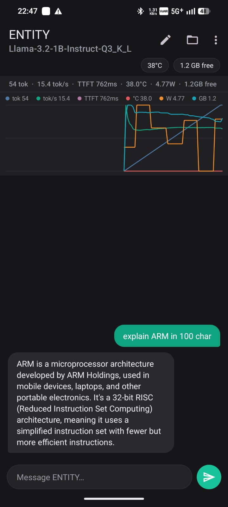
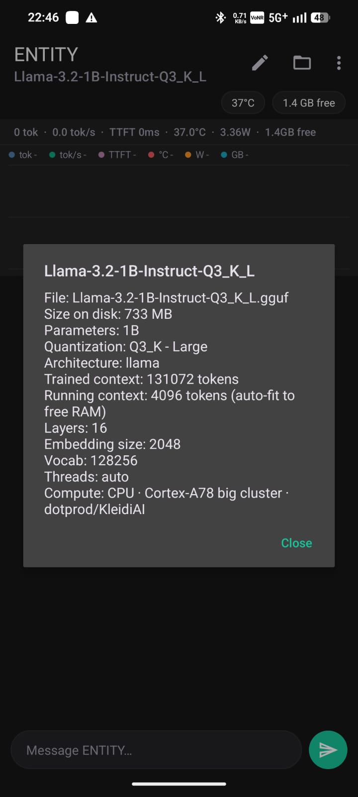
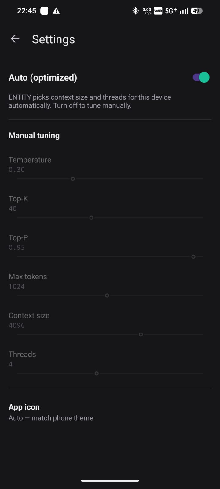

# ENTITY — an adaptive on-device LLM runtime for Arm phones

**Fully offline LLM chat for Android, tuned for the Arm CPU it's running on.**

[](github.md)
[](LICENSE)
[-3DDC84)](docs/BUILD.md)

**[Read the full hackathon submission write-up → `github.md`](github.md)**

---

ENTITY runs large language models **fully offline** on a phone and tunes itself to the device's
Arm CPU. It's not "a chatbot that uses llama.cpp" — it's a small **inference optimization layer**
(Kotlin UI + C++/JNI over llama.cpp), proven on real consumer hardware: a **CMF Phone 1**
(MediaTek Dimensity 7300, 6 GB RAM, Cortex-A78 + A55 big.LITTLE).

> Drop in any runnable GGUF model, and ENTITY profiles the device and configures itself to run it
> as fast as the phone allows — offline, with live speed/energy/thermal metrics.

## Why it's more than a demo

| Optimization | What it does |
|---|---|
| **Big-core affinity** | Pins inference to the Cortex-A78 performance cluster via `sched_setaffinity`, choosing cores by live `cpufreq` ranking — not a hardcoded core list. |
| **Device-tuned CPU backend** | A **single** `armv8.2-a + dotprod` build with Arm **KleidiAI** kernels, instead of the ~7 generic CPU variants most builds ship. Smaller APK, less startup RAM, faster launch. arm64-only. |
| **Adaptive context** | Context window sized from **model size + free RAM**, so any runnable model fits without OOM (a 1B gets a big window; a 3B is trimmed to fit a 6 GB phone). |
| **Auto (optimized) mode** | One switch applies all of the above. Turn it off to tune temperature, top-k, top-p, max tokens, context and threads by hand. |
| **Thermal-aware guard** | Eases off between tokens under sustained heat (Android's own thermal API) to hold steadier throughput instead of hard-throttling mid-answer. |
| **Live energy metrics** | tokens, tok/s, TTFT, temperature, **power draw (W)**, tokens/watt, free memory — as a stats bar and a toggleable multi-series graph. |

Honest framing: against a hand-tuned Termux CLI running the same cores and kernels, raw tokens/sec
are near-identical — no app beats a CLI on that one number. ENTITY's value is delivering the
optimization **automatically**, in the **foreground**, with **energy/thermal awareness** and a real
UI, beating the *default* (un-tuned) experience most users actually get. See
[`docs/OPTIMIZATIONS.md`](docs/OPTIMIZATIONS.md) for exactly what's implemented in the app versus
what was only demonstrated from the CLI.

## Features

- Fully offline chat (Llama 3.2 1B / 3B and any other runnable GGUF).
- In-app model picker via Storage Access Framework — no file browser, no adb required.
- Professional chat UI with smooth token streaming, **Stop** and **New chat**.
- Settings screen with an **Auto (optimized)** master toggle, or full manual tuning.
- Live metrics bar + toggleable multi-series graph (tokens, tok/s, TTFT, °C, W, free GB).
- In-app **benchmark** (⋮ → Benchmark): naive-vs-optimized speed, power, and tokens/watt, on your
  own loaded model.
- Light / Dark / System theme, with a theme-aware app-icon switcher.
- Model-info card that reads the GGUF header (params, quantization, architecture, context).

## Screenshots

| Chat + stats | Model Info | Settings |
|---|---|---|
|  |  |  |

## Prerequisites

- **JDK 17** (e.g., [Eclipse Temurin](https://adoptium.net/temurin/releases/?variant=jdk&version=17)).
- **Android SDK** with platform-tools, **build-tools 36**, and **NDK 27.1.12297006** (install via `sdkmanager --install "ndk;27.1.12297006" "cmake;3.31.6"`).
- **CMake 3.31.6** (also via sdkmanager, or via your OS package manager).
- An **arm64-v8a device** running Android 13+ with USB debugging enabled, and at least 2 GB free RAM.
- A runnable GGUF model (e.g., Llama-3.2-1B or -3B in Q4_0, from [Hugging Face / bartowski](https://huggingface.co/bartowski)).

## Quick start

**Fast path** (judge, no build): download a prebuilt APK from [`apk/`](apk/) and run `adb install -r <apk>`.

**Full build:**

```bash
# 1. Fetch llama.cpp and drop this app into its examples/ (or run ./setup.sh to automate)
curl -sL -o llama.tar.gz https://github.com/ggml-org/llama.cpp/archive/refs/heads/master.tar.gz
tar xzf llama.tar.gz
cp -r app/entity.android llama.cpp-master/examples/entity.android

# 2. Set toolchain paths and build
cd llama.cpp-master/examples/entity.android
export JAVA_HOME=/path/to/jdk-17
export ANDROID_HOME=/path/to/Android/sdk
./gradlew :app:assembleDebug --no-daemon --console=plain
# → app/build/outputs/apk/debug/app-debug.apk (~100 MB with native symbols)

# 3. Install and launch
adb install -r app/build/outputs/apk/debug/app-debug.apk
adb shell am start -n com.entity.chat/com.example.llama.MainActivity
```

In the app: tap the folder icon to **Import from device**, select a Q4_0 GGUF model, and chat.
To validate the optimization, run ⋮ → **Benchmark** (compares naive 8-core vs. optimized big-core performance on your loaded model).

## What makes this build Arm-optimized

ENTITY's build is tuned for the CMF Phone 1 / Dimensity 7300 (Cortex-A78 + A55, `armv8.2-a+dotprod`, no i8mm/SVE). These compile-time and runtime choices deliver the +34–59% speedup and 2–7.6× energy efficiency gain:

- **Single device-tuned backend** (`GGML_CPU_ALL_VARIANTS=OFF` + `GGML_CPU_ARM_ARCH=armv8.2-a+dotprod`): one CPU variant (KleidiAI/dotprod kernels) instead of 7 generic fallbacks — smaller APK, less startup RAM, no runtime dispatch overhead.
- **arm64-only build** (`abiFilters = ["arm64-v8a"]`): drops x86/x86_64 entirely, halving footprint and startup time.
- **Big-core affinity** (auto-detected at runtime via `cpufreq` ranking): inference pinned to Cortex-A78 cluster, not scattered across slow A55s — recovers ~2× on generation throughput.
- **Adaptive context window**: KV-cache auto-sized from model size + free RAM, so any runnable model fits without OOM.

To retarget for a different Arm SoC, change `GGML_CPU_ARM_ARCH` in `lib/build.gradle.kts` (or see `docs/BUILD.md` for detailed steps). See [`docs/OPTIMIZATIONS.md`](docs/OPTIMIZATIONS.md) for the full breakdown of each technique and exact file locations.

## Repository map

```
app/entity.android/   The Android app: Kotlin UI module (com.example.llama) +
                       native inference library module (com.arm.aichat, JNI + C++)
apk/                   Prebuilt debug APKs, one per tagged version (see apk/README.md)
releases/              Copy-paste-ready GitHub Release notes, one per version
docs/                  ARCHITECTURE.md, BUILD.md, OPTIMIZATIONS.md, CONTRIBUTING.md,
                       plus BENCHMARKS.md / CHANGELOG.md / submission-process docs
benchmarks/            Measured results (BENCHMARKS.md) + raw logs, CSVs, and charts
scripts/               Termux / llama.cpp CLI benchmark + chat scripts (optimized + naive)
screenshots/           App screenshots used in this README and github.md
CHANGELOG.md           Full per-version history (Keep a Changelog format)
github.md              The hackathon submission write-up
SETUP.md               Short build reference (docs/BUILD.md has the full version)
```

## Documentation

- **[`github.md`](github.md)** — the full hackathon submission (problem, approach, measured results).
- **[`docs/ARCHITECTURE.md`](docs/ARCHITECTURE.md)** — how the app is put together end to end, with a
  component diagram and the UI → JNI → llama.cpp token flow.
- **[`docs/BUILD.md`](docs/BUILD.md)** — reproducible build/run/validate steps and how to retarget
  the native build to a different Arm SoC.
- **[`docs/OPTIMIZATIONS.md`](docs/OPTIMIZATIONS.md)** — a deep dive on each optimization, each
  pointing at the exact file/function that implements it.
- **[`docs/CONTRIBUTING.md`](docs/CONTRIBUTING.md)** — how to continue this project: conventions,
  adding a screen, touching the native layer, and a next-steps list.
- **[`CHANGELOG.md`](CHANGELOG.md)** — what changed in each version, with file-level diffs.

## Hardware target

MediaTek Dimensity 7300: 4× **Cortex-A78 @2.5 GHz** (cpu 4-7, `armv8.2-a + dotprod`) + 4×
Cortex-A55 @2.0 GHz (cpu 0-3). No i8mm / SVE / SME — so dotprod + KleidiAI is the right
acceleration path here, and Q4_0 (fast dotprod kernels) often beats a "smaller" 3-bit format. The
affinity logic itself is SoC-agnostic (ranks cores by live `cpufreq`); only the compiled backend is
tuned to this chip — see [`docs/BUILD.md`](docs/BUILD.md) to retarget it.

## License

Apache License 2.0 — see [LICENSE](LICENSE). Built on [llama.cpp](https://github.com/ggml-org/llama.cpp) (MIT) and
Arm [KleidiAI](https://gitlab.arm.com/kleidi/kleidiai) (Apache-2.0).
