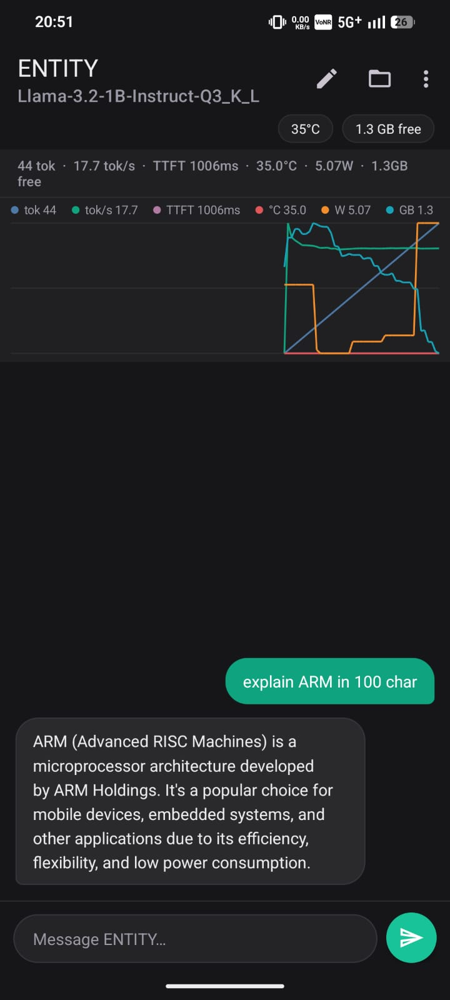
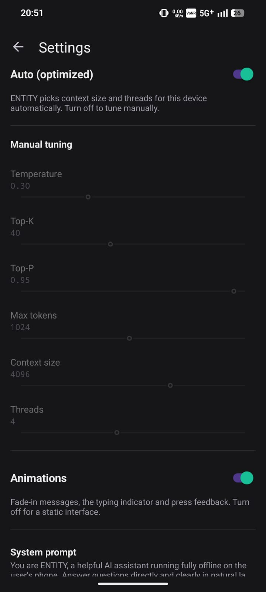

# ENTITY: adaptive on device LLM runtime for Arm phones

**Fully offline Android chat that tunes llama.cpp to the Arm CPU in the phone.**

[Read the complete Arm Create submission](github.md)

## Navigation

[Home](README.md) · [Benchmarks](benchmarks/BENCHMARKS.md) · [Optimization](docs/OPTIMIZATIONS.md) · [FAQ](docs/FAQ.md) · [Contributing](docs/CONTRIBUTING.md) · [License](LICENSE)

## What ENTITY is

ENTITY is a private Android assistant that runs runnable GGUF language models entirely on the phone. It is built as an inference optimization layer around llama.cpp with a Kotlin interface and a C++ JNI inference path.

The current release is built for arm64 Android phones running Android 13 or later. It has been measured on a CMF Phone 1 with MediaTek Dimensity 7300 and independently validated on a Qualcomm Snapdragon 6 Gen 4 phone.

**[Get the latest release](https://github.com/kkjjkamal123/Daily-Track/releases/latest)**

## What makes it different

| Runtime decision | What ENTITY does |
|---|---|
| CPU backend | Ships seven Arm CPU backend variants from Arm v8.0 through Arm v9.2. ggml loads the best supported variant at startup with KleidiAI kernels available in every variant. |
| Fast core selection | Reads maximum CPU frequency from the device then ranks the cores. Decode runs on the fastest two to four cores rather than waiting for slower efficiency cores. |
| Separate thread pools | In Auto mode token generation stays on the fast core set while prompt processing can use every online core. |
| Adaptive context | Selects a 2048 to 8192 token context from model size and free RAM. This lets a 3B class model use a smaller window when memory is tight. |
| Thermal policy | Checks Android thermal status during generation and adds a small cooperative delay when heat rises. Efficiency mode doubles the delay and caps inference at two threads. |
| Energy telemetry | Reports tokens, token rate, time to first token, temperature, power, token per watt and free memory. |

ENTITY does not claim to beat a tuned command line build on raw token rate. Its purpose is to give a normal phone user the same hardware aware decisions in a responsive foreground app with live energy and thermal information.

## Features

1. Fully offline chat with Llama 3.2 1B, Llama 3.2 3B and other runnable GGUF models.
2. In app model import through Android Storage Access Framework.
3. Streaming replies with Stop, New chat, Markdown rendering, Copy and Regenerate.
4. Persistent local conversations with restore, rename, switch and delete actions.
5. Auto mode plus manual controls for temperature, top k, top p, completion length, context and threads.
6. Live statistics and a selectable graph for token count, token rate, TTFT, temperature, power and memory.
7. In app benchmark with three run median, population standard deviation, thermal cooldown and CSV export.
8. Light, dark and system themes plus a theme aware app icon.
9. GGUF model information including parameters, quantization, architecture and running context.

## Screenshots

| Chat | Benchmark | Settings |
|---|---|---|
|  |  |  |

## Current in app benchmark

The benchmark uses Llama 3.2 1B Instruct Q3 K L with 512 prompt tokens and 128 generated tokens. Each configuration runs three times on an unplugged phone. Values are median plus or minus population standard deviation.

### CMF Phone 1: MediaTek Dimensity 7300

| Metric | Naive eight cores | ENTITY Auto four fast cores | Result |
|---|---:|---:|---:|
| Prompt throughput | 42.2 ± 0.34 tok per s | 43.2 ± 1.8 tok per s | +2% |
| Decode throughput | 8.0 ± 1.1 tok per s | 17.7 ± 0.56 tok per s | +121% |
| Derived TTFT | 12245 ± 108 ms | 11907 ± 452 ms | 3% lower |
| Power | 4.7 ± 0.34 W | 4.0 ± 0.22 W | lower |
| Energy efficiency | 1.7 ± 0.36 tok per W | 4.2 ± 0.23 tok per W | 2.5× |

### OPPO CPH2729: Qualcomm Snapdragon 6 Gen 4

| Metric | Naive eight cores | ENTITY Auto four fast cores | Result |
|---|---:|---:|---:|
| Prompt throughput | 39.3 ± 2.2 tok per s | 47.7 ± 0.12 tok per s | +21% |
| Decode throughput | 6.0 ± 1.1 tok per s | 13.1 ± 0.05 tok per s | +117% |
| Derived TTFT | 13194 ± 672 ms | 10811 ± 28 ms | 18% lower |
| Power | 3.4 ± 0.15 W | 3.4 ± 0.29 W | flat |
| Energy efficiency | 1.8 ± 0.24 tok per W | 3.8 ± 0.31 tok per W | 2.1× |

TTFT in this benchmark is an estimate from prompt evaluation plus one decode step. It is not a live chat first token measurement. Read the full [benchmark method and caveats](benchmarks/IN_APP_BENCHMARK.md).

## Get started

1. Install the current release signed APK from [apk](https://github.com/kkjjkamal123/ENTITY---Arm-Create-AI-Optimization-Challenge/releases/latest).
2. Open ENTITY and choose Import from device.
3. Select a runnable GGUF model.
4. Leave Auto mode enabled for device aware CPU and context decisions.
5. Open Benchmark from the app menu to compare the naive path with the optimized path on the loaded model.

To build from source use the exact Android SDK, NDK, CMake and JDK setup in [BUILD](docs/BUILD.md). The release build is arm64 only and includes all seven CPU backend variants.

## Repository guide

| Location | Purpose |
|---|---|
| app/entity.android | Kotlin Android app and the native C++ inference library |
| apk | Debug and release signed APKs |
| benchmarks | Current app measurement, historical command line results and raw records |
| docs | Architecture, build instructions, optimization details and contributor guidance |
| releases | Release notes for every version |
| scripts | Termux benchmark and chat helpers |
| screenshots | Images used in this README |
| github.md | Full Arm Create submission |

## Documentation

1. [Architecture](docs/ARCHITECTURE.md): UI to JNI to llama.cpp design.
2. [Build](docs/BUILD.md): reproducible toolchain and installation steps.
3. [Optimizations](docs/OPTIMIZATIONS.md): source level explanation of each runtime decision.
4. [Benchmark summary](<benchmarks/Benchmark Summary.md>): judge focused benchmark brief.
5. [In app benchmark](benchmarks/IN_APP_BENCHMARK.md): current method, values and caveats.
6. [Contributing](docs/CONTRIBUTING.md): project conventions and next steps.

## License

ENTITY is licensed under [Apache License 2.0](LICENSE). It builds on llama.cpp and Arm KleidiAI.
