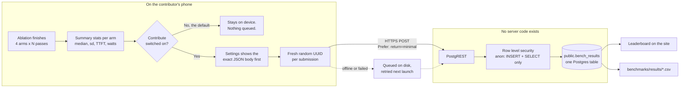
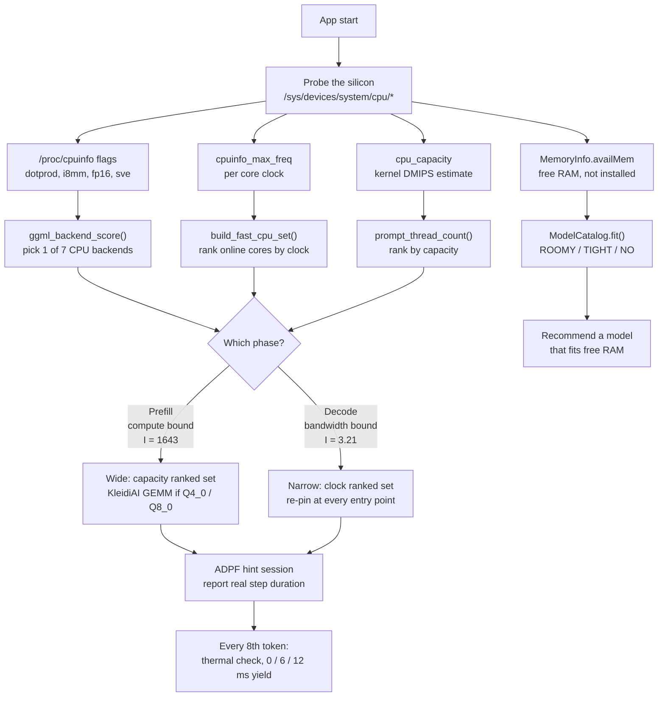

<div align="center">


# ENTITY

<b>An offline LLM runtime that tunes itself to the Arm CPU in your phone.</b>

[](LICENSE)
[](#quick-start)
[](https://github.com/kkjjkamal123/ENTITY---Arm-Create-AI-Optimization-Challenge/releases)
[](docs/KLEIDIAI-QUANTS.md)
[](https://github.com/ggml-org/llama.cpp/pull/25701)

[demo](https://youtu.be/ZD_jpyBqkF8) / [evidence](#evidence-at-a-glance) / [dataset](#the-dataset) / [benchmarks](benchmarks/BENCHMARKS.md) / [ledger](docs/LEDGER.md) / [limitations](#known-limitations) / [submission](github.md)

</div>

## Quick start

Any arm64 phone on Android 13 or later. Install the signed APK:

```bash
git clone https://github.com/kkjjkamal123/ENTITY---Arm-Create-AI-Optimization-Challenge.git
cd ENTITY---Arm-Create-AI-Optimization-Challenge
adb install -r apk/ENTITY-v26-review-fixes-20260814-release.apk
```

The [releases page](https://github.com/kkjjkamal123/ENTITY---Arm-Create-AI-Optimization-Challenge/releases/latest) has the same APK plus **ENTITY Bench**, the standalone benchmark app.

Then on the phone:

1. Tap the model line in the header. **Download a model...** picks from a catalog tagged for your phone. **Import from device...** takes a GGUF you already have, say [Llama-3.2-1B-Instruct-Q4_0.gguf](https://huggingface.co/bartowski/Llama-3.2-1B-Instruct-GGUF). Pick a **Q4_0** build if you can. It is one of only two quantizations Arm's KleidiAI kernels touch ([why](docs/KLEIDIAI-QUANTS.md)).
2. Leave **Auto** on. It works out thread count, core placement and context from whatever silicon it finds.
3. Open **BENCHMARK** from the drawer for the three arm ablation. **Unplug the phone first.** Power and tokens per watt only show on battery, because a charging phone reports the charger's current instead of the workload's.

To build from source you need the exact SDK, NDK, CMake and JDK versions listed in [BUILD](docs/BUILD.md). The release build is arm64 only and ships all seven CPU backend variants.

## What ENTITY is

ENTITY is a private Android assistant. It runs GGUF language models entirely on the phone, as an optimization layer over llama.cpp with a Kotlin front end and a C++ JNI inference path.

The current release targets arm64 phones on Android 13 or later. I measured it on a CMF Phone 1 with a MediaTek Dimensity 7300 and checked it again on a Qualcomm Snapdragon 6 Gen 4.

## What makes it different

| Runtime decision | What ENTITY does |
|---|---|
| CPU backend | Ships seven Arm CPU backend variants from Arm v8.0 through Arm v9.2. ggml loads the best supported variant at startup. |
| KleidiAI advisor | Arm's KleidiAI has kernels for Q4_0 and Q8_0 only. Every other quantization silently falls back to generic ggml. ENTITY reads the GGUF header and tells you whether the model you loaded can actually reach Arm's kernels, and what it costs when it cannot. |
| Fast core selection | Reads maximum CPU frequency from the device then ranks the cores. Auto derives its thread count from the size of the top frequency cluster (two to six cores; four on the reference 4+4 phone) and runs both inference phases there instead of waiting on the slower efficiency cores. |
| Adaptive context | Selects a 2048 to 8192 token context from model size and free RAM. This lets a 3B class model use a smaller window when memory is tight. |
| Thermal policy | Checks Android thermal status during generation and adds a small cooperative delay when heat rises. Efficiency mode doubles the delay and caps inference at two threads. |
| Energy telemetry | Reports tokens, token rate, time to first token, temperature, power, token per watt and free memory. |
| Three arm ablation | The benchmark does not just report a number, it attributes it. Naive, threads only and Auto, so a reader can see which decision earned the speed up and which did not. |

ENTITY does not claim to beat a tuned command line build on raw token rate. The point is to hand a normal phone user the same hardware aware decisions inside a responsive app, with live energy and thermal readings while it runs.

## Evidence at a glance

The challenge names **performance-per-watt** as a judging axis, so I lead with the number most on-device apps never bother to measure. What the same output costs your battery. Everything below was measured on the phone and comes with the limits it holds inside. Where my own ablation killed one of my headline claims, that is in the table too.

| Claim | Evidence | Boundary |
|---|---|---|
| **The same output costs 42% less battery** | Each pass samples battery current and voltage every 150 ms; watts and tok/W appear only while unplugged. Integrated over a pass, the same 128 tokens cost **86 J naive versus 50 J optimized**. That is 42% less battery, and it comes from finishing in 11.8 s instead of 19.9 s at the same watts. On the Snapdragon 6 Gen 4, pinning holds decode flat while cutting median power 2.52 to 1.78 W: **tok/W 6.80 to 9.85 (+45%)**. | Battery current reporting is OEM dependent. Comparative on one device, not lab grade metering. |
| Auto is much faster than the out of the box default | Current five-run exports (2026-07-18): decode 10.8 to 18.1 tok/s (+68%) on the CMF Phone 1 and 9.7 to 17.5 tok/s (+81%) on an OPPO Snapdragon 6 Gen 4. The July record read +81% to +106% across two models. | Two phones, 1B and 3B models. Not a universal multiplier. |
| **The thread count earns the multiplier; what pinning adds is device dependent** | The threads only arm runs Auto's thread count with affinity switched off. The current five-run exports: on the Dimensity 7300 pinning adds **+21% decode** (distributions non overlapping); on the Snapdragon 6 Gen 4 it adds +1% decode but cuts median power 2.52 to 1.78 W (tok/W 6.80 to 9.85). July's three-run sets on the chat app's bench read pinning at ~0%, and the v2.0.0 claim of "+121% from big core affinity" was wrong either way. My own ablation is what showed it. | Per-SoC behavior, not a universal rule. The July ~0% record is retained; the raw CSVs keep the difference answerable. |
| **KleidiAI only accelerates Q4_0 and Q8_0** | Verified in Arm's kernel source. Every benchmark published before v2.1.0 used Q3_K_L, so KleidiAI never ran. Switching to Q4_0, same phone and same thread config: prompt 43 to 121 tok/s, TTFT 12.1s to 4.3s. On an i8mm phone (Snapdragon 6 Gen 4) the loaded backend's MATMUL_INT8 GEMM adds a further **+32% prompt** over dotprod on Q4_0 (190.6 vs 143.7 tok/s, cold). | Decode does not improve. It is bandwidth bound and tracks bytes per weight, not kernel quality. Q4_0 is also a quality tradeoff, so ENTITY recommends rather than switches. |
| Widening prompt processing to all cores was a regression | Prompt on 4 fast cores measures 135 tok/s; spread across all 8 it measures 86. The efficiency cores gate every GEMM. Removed in v2.1.0. | Empirical to this SoC. A tri cluster chip may prefer a wider pool, so the benchmark decides it instead of me assuming. |
| A developer can reproduce or challenge any of it | The app runs the ablation and exports every pass to CSV. Each arm logs the CPU mask the kernel actually applied, so a failed pin cannot pass as "pinning earns nothing". The device card's optimization indicator shows which Arm levers are live on the phone in hand. | A matching device and model are needed for a direct numerical comparison. |
| **The speedup does not change the model's output** | Four scheduling arms, one device, greedy decoding at a fixed seed plus per-chunk perplexity. Eight threads against the shipped four is the only pair where ggml's reduction width changes, and it is the baseline the decode gain is measured from. It produced the same 96 tokens byte for byte and the same twelve per-chunk values. Three controls, including one showing the per-chunk series *does* move when batch shape changes rather than thread count. | Not bit-exactness: the series prints to four decimals, and greedy decoding only reveals a perturbation big enough to change an argmax. One device, one model. |
| **Six of the ten optimizations are removed or crippled on another arm64 platform** | Ported the same intent to Apple silicon, which is also arm64 and also big.LITTLE. **Four cease to exist outright**: per-core frequency, ADPF deadline hints, energy telemetry and multi-variant v8.0-v9.2 backend dispatch. **Two survive only degraded**: core placement falls back to a QoS request that cannot be verified or read back, and thermal detail collapses to four coarse levels. Two others get *better*. Measured on two iPhones: the runtime picks **one** thread, and a second costs +16.8% and +11.4%. KleidiAI still pays (1.089x, 1.045x). | Different runtime and model from the Android record (ONNX int8, not llama.cpp GGUF), so the two are never compared numerically. Two devices, one workload. |

| **The decode gain holds on silicon the author has never touched** | ENTITY Bench uploads a finished ablation, opt in, to a public Postgres table. **26 contributed runs from 13 distinct devices across 9 SoC families and 4 vendors**, those being MediaTek, Qualcomm, Samsung Exynos and Google Tensor, from a TECNO on a Helio G37 to a Pixel 10 on Tensor G5. Decode improved in **26 of 26**, median **1.78x**, range **1.34x to 4.27x**. Prompt regressed in 2 of 26. Both are kept in the table. | A self selected sample, not a random one, run under contributors' own thermal state and Android version (4 releases). Near controlled on the workload: two model files only, Q4_0 and Q8_0. 20 of 26 ran unplugged, so only those carry valid power columns. |

This is the short judge facing map. [Benchmarks](benchmarks/BENCHMARKS.md) has the full record, the graphs, and the limits.

---

## The dataset

Most of the claims above were measured on two phones. That is what one student with two devices can honestly do. It is also the limit I built ENTITY Bench to get past, since the app that runs the experiment can just as well send back the answer.

ENTITY Bench has a one tap **Contribute** action. It posts a finished ablation to a Postgres table behind PostgREST. Summary statistics per arm only. The per pass 150 ms trace never leaves the phone. What has come in so far:

| | Contributed | |
|---|---|---|
| | **26** submissions | Jul 22 to Jul 27 2026 |
| | **13** distinct devices | 13 SoCs, 9 SoC families |
| | **4** silicon vendors | MediaTek 5 devices, Qualcomm 5, Exynos 2, Tensor 1 |
| | **26 / 26** improved decode | median **1.78x**, range 1.34x to 4.27x |
| | **20 / 26** power valid | the rest were charging, so their watts are the charger's |

<picture>
  <source media="(prefers-color-scheme: dark)" srcset="docs/diagrams/contribution-pipeline-dark.svg">
  
</picture>

<details>
<summary>Mermaid source for this diagram</summary>



</details>

**Why this is the strongest evidence here.** A table built only from phones I own cannot tell my optimization apart from the hardware I tuned it on. These 13 devices were set up by strangers in their own rooms at their own starting temperatures. The decode gain held on all of them. The two prompt regressions held too. Both are in the table.

**What gets sent.** Contribution is **off until you turn it on**. No first run upload. No "anonymous statistics" default. Settings shows you the exact JSON body before anything is sent. Every submission gets a **fresh random UUID** that exists only to drop duplicates, so two runs from one phone cannot be tied together. The body is device model, SoC, CPU flags, core topology, model file and the per arm medians. No account. No advertising ID. No location. No chat content. The chat app holds no network permission at all.

**The key in the APK is public on purpose.** Row level security gives the shipped anon key `INSERT` and `SELECT` and nothing more. It can append a run and read the public dataset. It cannot update or delete anything, its own row included. The endpoint itself is a build config value left **blank in the public source**, so a fork builds with contribution switched off instead of posting into this database.

Raw exports live in [`benchmarks/results/`](benchmarks/results/); the table definition is [`benchmarks/contribute-schema.sql`](benchmarks/contribute-schema.sql) and the backend write up is [`benchmarks/CONTRIBUTE-BACKEND.md`](benchmarks/CONTRIBUTE-BACKEND.md).

## How ENTITY decides

No vendor table. No device allowlist. No cloud lookup. The runtime reads what the kernel already knows about the silicon it woke up on and works out a policy in roughly 60 ms.

<picture>
  <source media="(prefers-color-scheme: dark)" srcset="docs/diagrams/decision-flow-dark.svg">
  
</picture>

<details>
<summary>Mermaid source for this diagram</summary>



</details>

Everything hangs on the two branches out of **Which phase?**. Prefill and decode look like one workload but they are not. You can see it in the arithmetic before you run a single benchmark.

### The arithmetic, and the constants it comes from

Arithmetic intensity is FLOPs done per byte moved. A matmul over the full weight set does **2P** FLOPs per token for **P** parameters. It still has to read **B** bytes of weights no matter how many tokens are in flight. For a batch of **N** tokens:

$$I = \frac{2PN}{B} \qquad\text{giving}\qquad \frac{I_{\text{prefill}}}{I_{\text{decode}}} = N$$

Decode is just `N = 1`. Both numbers in the flowchart drop out of two fields on the shipping catalog entry for Llama 3.2 1B Q4_0 in [`ModelCatalog.kt`](app/entity.bench.android/app/src/main/java/com/entity/bench/ModelCatalog.kt), `1.24` billion parameters and `773_025_920` bytes:

| Phase | Substitution | Result |
|---|---|---:|
| Decode, `N = 1` | `2 x 1.24e9 / 773,025,920` | **3.21** FLOP/byte |
| Prefill, `N = 512` | `512 x 3.21` | **1643** FLOP/byte |

**One policy cannot serve a 512x gap between two phases of the same model.** Prefill sits well to the right of any Arm CPU's roofline ridge point. It is compute bound and wants every core that can retire a MAC, so the prefill width comes from `cpu_capacity`. That is also why KleidiAI's INT8 GEMM shows up as **+379% prompt** on the ISA ladder and does nothing at all for decode. Decode at 3.21 sits far to the left. It is bandwidth bound. The weights cross the bus once per token whatever you do, so once the bus saturates, extra cores buy you queueing instead of throughput. That is the measurement behind "eight threads on a 4+4 phone let the Cortex A55s gate every decode step".

You can also break this claim. If decode were compute bound, going wider would help and the naive 8 thread arm would beat Auto's 4. It loses on all 13 contributed devices.

---

## Benchmarks

The benchmark runs a synthetic PP 512 / TG 128 workload on the loaded model, unplugged, with a thermal cooldown before every pass. Three arms instead of two, so you can see where a number came from instead of taking my word for it. Naive is 8 threads across all cores. Threads only takes Auto's thread count and switches core pinning off, which is what an upstream `llama.cpp -t N` run gives you. Then ENTITY Auto.

### Where the speed up actually comes from

The current benchmark of record is the pair of four arm, five runs per arm ENTITY Bench v1.1.0 exports taken 2026-07-18, unplugged, raw CSVs retained. The fourth arm pins Auto's threads to the LITTLE cluster to test whether the efficiency cores are actually efficient:

| Device | Naive, 8 thr | Threads only, 4 thr no pin | ENTITY Auto, 4 thr pinned | Efficiency, 4 thr LITTLE | Thread count earns | Pinning earns |
|---|---:|---:|---:|---:|---:|---:|
| CMF Phone 1, Dimensity 7300 | 10.8 ± 1.3 | 15.0 ± 0.5 | **18.1 ± 0.4** | 15.0 ± 0.3 | **+39%** | **+21%** |
| OPPO CPH2729, Snapdragon 6 Gen 4 | 9.7 ± 0.5 | 17.4 ± 0.3 | **17.5 ± 0.2** | 14.3 ± 0.1 | **+80%** | +1% |

<picture>
  <source media="(prefers-color-scheme: dark)" srcset="benchmarks/plots/four_arm_decode_20260718-dark.png">
  
</picture>

The thread count is the universal earner. What pinning adds depends on the SoC: decode on the Dimensity (+21%, the pinned and unpinned distributions do not overlap), power on the Snapdragon (2.52 to 1.78 W median, tokens per watt 6.80 to 9.85). And on both phones the LITTLE pinned arm loses on speed and on tok/W. The efficiency cores are not an efficiency win for LLM decode, which is why the affinity policy is measured per device instead of assumed.

The July 2026 three arm record that first split the attribution, CMF Phone 1:

| Model | Naive, 8 threads | Threads only, 4 threads no pin | ENTITY Auto, 4 threads pinned | Thread count earns | Pinning earns |
|---|---:|---:|---:|---:|---:|
| Llama 3.2 1B Q3_K_L, 3 runs | 8.8 ± 0.50 | 16.9 ± 0.08 | 16.7 ± 1.3 | **+92%** | **-1%** |
| Llama 3.2 1B Q4_0, 1 run | 7.9 | 14.7 | 14.7 | **+86%** | **+0%** |
| Llama 3.2 1B Q4_0, 3 runs | 7.7 ± 0.78 | 15.9 ± 0.22 | 16.0 ± 2.1 | **+106%** | +1% |
| Llama 3.2 1B Q4_0, 3 runs (repeat) | 8.6 ± 0.82 | 15.9 ± 1.58 | 15.9 ± 0.09 | **+85%** | **+0%** |
| Llama 3.2 3B Q4_0, 1 run | 3.1 | 6.0 | 6.8 | **+94%** | +13% |
| Llama 3.2 3B Q4_0, 1 run | 3.5 | 6.3 | 6.3 | **+81%** | **+0%** |

<picture>
  <source media="(prefers-color-scheme: dark)" srcset="benchmarks/plots/decode_attribution-dark.png">
  
</picture>

Eight threads on a 4+4 big.LITTLE phone let the Cortex A55s gate every decode step. Using four threads removes that. In this July record the pinning added nothing measurable. Identical 15.9 tok/s medians pinned and unpinned in the repeat set, with the pinned arm's spread collapsing from 1.58 to 0.09, so pinning bought repeatability instead of speed. The 2026-07-18 five run exports above are the current statement, +21% on this same phone and +1% on the OPPO. The difference between the two records is kept as an open question in [the benchmark record](benchmarks/BENCHMARKS.md). What every set agrees on: the v2.0.0 claim that +121% came from big core affinity was wrong. My own ablation proved it.

### KleidiAI never ran

Arm's KleidiAI ships matmul kernels for Q4_0 and Q8_0 only. Every other quantization, including the whole K quant family, falls back to generic ggml no matter which backend variant loaded. Every benchmark published before v2.1.0 used Q3_K_L, so Arm's kernels never executed. The fallback is silent; a one-time upstream warning is contributed in [llama.cpp PR #25701](https://github.com/ggml-org/llama.cpp/pull/25701) (**merged upstream 2026-07-21**, commit `fb0e6b6`), and the full write-up is in [Which GGUF quant actually reaches KleidiAI](docs/KLEIDIAI-QUANTS.md).

Same phone, same 512 token prompt, same four thread unpinned config. Only the quantization differs:

| | Q3_K_L, no Arm fast path | Q4_0, Arm fast path | Change |
|---|---:|---:|---:|
| Prompt throughput | 42.7 tok per s | **121 tok per s** | **+183%** |
| Time to first token | 12050 ms | **4299 ms** | **-64%** |
| Decode throughput | 16.9 tok per s | 14.7 tok per s | -13% |

This isolates the **quantization**, not KleidiAI specifically: moving to Q4_0 switches on both KleidiAI's kernels and ggml's Arm repack path at once, and the split between them has not been measured on this phone. Independent measurements suggest the KleidiAI flag adds little at Q4_0 (its clear win is at Q8_0). See [what this does not attribute](docs/KLEIDIAI-QUANTS.md#what-this-measures-and-what-it-does-not-attribute).

<picture>
  <source media="(prefers-color-scheme: dark)" srcset="benchmarks/plots/kleidiai_prompt_ttft-dark.png">
  
</picture>

Prompt evaluation is a compute bound GEMM, which is what KleidiAI accelerates. Decode is memory bandwidth bound and tracks bytes per weight and not kernel quality, so it does not improve: Q4_0 is about 6% more bytes and lands slightly slower. Q4_0 is also a quality tradeoff, and the cost is measured now instead of asserted: **+5.6% perplexity against Q4_K_M** on Llama-3.2-1B (15.6159 vs 14.7346, wikitext-2 test, 200 chunks), for 4.5% fewer bytes and a prompt path Q4_K_M cannot reach at all. ENTITY recommends instead of switching silently. The model card reports both sides. Full table: [`docs/QUANTIZATION-QUALITY.md`](docs/QUANTIZATION-QUALITY.md).

### What the user actually gets

Llama 3.2 1B, ENTITY Auto, unplugged:

| | v2.0.0, Q3_K_L, prompt widened to all cores | v2.1.0, Q4_0, prompt on the fast cores |
|---|---:|---:|
| Prompt throughput | 38.3 tok per s | **133 tok per s** |
| **Time to first token** | **13440 ms** | **3918 ms** |
| Decode throughput | 16.7 tok per s | 14.7 tok per s |

Time to first token, the latency a user feels on a long prompt, drops 3.4 times. Decode gives up about 12%, the bandwidth cost of the larger quantization, and the benchmark screen shows both sides of the trade.

TTFT here is derived from prompt evaluation plus one decode step. It is not a live chat first token measurement. Full method, the historical two arm v2.0.0 record, and every limit: [benchmarks](benchmarks/BENCHMARKS.md).

The same ablation now ships as a standalone app, [ENTITY Bench](app/entity.bench.android/README.md), so a developer can run it on their own SoC and contribute a device row without installing the full chat app.

### Against the competition

Same phone, same `Llama-3.2-1B-Instruct-Q4_0`, same PP 512 / TG 128 workload, each app's own benchmark screen. All three re-measured in one session on 2026-07-20, five runs each, 30 minute cooldown between apps so nobody inherits another's heat:

| App | Prompt | Token generation | Threads |
|---|---:|---:|---|
| PocketPal AI | 88.32 tok per s | 13.9 tok per s | 6 |
| Arm AI Chat (Arm's own app) | 121 tok per s | 12.4 tok per s | not reported |
| **ENTITY** | **128 tok per s** | **18.2 tok per s** | 4, pinned |

<picture>
  <source media="(prefers-color-scheme: dark)" srcset="benchmarks/competitor-comparison/three_app_comparison-dark.png">
  
</picture>

Against Arm's own reference app, on Arm's own silicon: 6% on prompt and **47% on token generation**. Against PocketPal: 45% and 31%.

Decode is where the thread count policy acts and where the margin is. The prompt column is close because all three apps run Q4_0 and reach the same KleidiAI kernels, so that column mostly measures whether an app got the quantization right, and here everyone did. The decode margin has a named mechanism behind it, not a mystery: PocketPal runs **6 threads on a 4+4 chip**, so two of them land on Cortex-A55s at roughly a third of an A78's throughput and every decode step waits on them. That is the straggler bound this project's own ablation measures, just less severe than the naive 8 thread arm.

The same three apps were measured on 2026-07-14 and the repeat did not agree with it. PocketPal and Arm swapped places on decode, and ENTITY's prompt margin over Arm narrowed from 11% to 6%. Both sessions are published with their dates, because PocketPal's decode swinging about 27% between sessions on identical hardware, while Arm's held within about 4%, is exactly why a figure from one session must never be paired with a figure from another. Full setup, both sessions, screenshots and caveats: [competitor comparison](benchmarks/competitor-comparison/README.md).

## Features

1. Fully offline chat with Llama 3.2 1B, Llama 3.2 3B and other runnable GGUF models.
2. In app model import through Android Storage Access Framework.
3. Streaming replies with Stop, New chat, Markdown rendering, Copy and Regenerate.
4. Persistent local conversations with restore, rename, switch and delete actions.
5. Auto mode plus manual controls for temperature, top k, top p, completion length, context and threads.
6. Live statistics and a selectable graph for token count, token rate, TTFT, temperature, power, app CPU utilization and free memory.
7. In app benchmark with a three arm ablation (naive, threads only, Auto), three run median, population standard deviation, thermal cooldown, decode attribution and CSV export. Every finished run is saved on the phone automatically, with a history screen to reopen, copy, re-export or delete any past run.
8. One tap opt in contribution in ENTITY Bench: a finished ablation posts to the public dataset described in [The dataset](#the-dataset), which is how the decode claim was tested on 13 devices the author does not own.
9. Light, dark and system themes plus a theme aware app icon.
10. GGUF model information including parameters, quantization, architecture and running context.

---

## Screenshots

<table>
  <tr>
    <td align="center"><br><i>Chat</i></td>
    <td align="center"><br><i>Three arm ablation</i></td>
    <td align="center"><br><i>Auto mode and manual controls</i></td>
  </tr>
</table>

<details>
<summary>Earlier interface, version 2.4.0 and below</summary>

<table>
  <tr>
    <td align="center"><br><i>Chat</i></td>
    <td align="center"><br><i>Benchmark</i></td>
    <td align="center"><br><i>Settings</i></td>
  </tr>
</table>

</details>

## Repository guide

The canonical source repository is [kkjjkamal123/ENTITY---Arm-Create-AI-Optimization-Challenge](https://github.com/kkjjkamal123/ENTITY---Arm-Create-AI-Optimization-Challenge).

| Location | Purpose |
|---|---|
| app/entity.android | Kotlin Android app and the native C++ inference library |
| app/entity.bench.android | Standalone benchmark app: runs the three arm ablation on any arm64 phone and exports the result to CSV |
| apk | Debug and release signed APKs |
| benchmarks | Current app measurement, historical command line results and raw records |
| quant-lab | Quantization quality lab and the output equivalence measurement: the runners, `RESULTS.md`, and every raw output they produced |
| ios | The Apple silicon control: a SwiftUI port of the benchmark's structure, its two builds, and the reason its workload is synthetic |
| docs | Architecture, build instructions, optimization details and contributor guidance |
| releases | Release notes for every version |
| scripts | Termux benchmark and chat helpers |
| screenshots | Images used in this README |
| templates | Copyable Arm64 Android runtime starter and device benchmark schema |
| github.md | Full Arm Create submission |

## Documentation

1. [Architecture](docs/ARCHITECTURE.md): UI to JNI to llama.cpp design.
2. [Build](docs/BUILD.md): reproducible toolchain and installation steps.
3. [Optimizations](docs/OPTIMIZATIONS.md): source level explanation of each runtime decision.
4. [Which GGUF quant actually reaches KleidiAI](docs/KLEIDIAI-QUANTS.md): the two types Arm's kernels accelerate, and what the rest cost.
5. [Benchmarks](benchmarks/BENCHMARKS.md): current method, cross device values, and caveats.
6. [Reproducibility](benchmarks/REPRODUCIBILITY.md): protocol, CSV evidence schema, source pointers, and evidence limits.
7. [Runtime comparisons](benchmarks/COMPARISONS.md): a fair upstream llama.cpp baseline and the requirements for any ExecuTorch or MLC-LLM claim.
8. [Quantization and output equivalence lab](quant-lab/RESULTS.md): what each quantization costs in quality, and the measurement showing the scheduling speedups leave the model's output unchanged. Four arms, three controls, raw files included.
9. [Arm against Apple silicon](docs/PORTABILITY-ARM-VS-APPLE-SILICON.md): six of ENTITY's ten optimization mechanisms are removed or crippled on a platform that is also arm64. Measured on two iPhones, including a thread sweep where the second thread is a straight loss.
10. [FAQ](docs/FAQ.md): device support, models, Auto mode, privacy, and troubleshooting answers.
11. [Arm64 Android starter kit](templates/arm64-android-runtime/README.md): copyable runtime policy, affinity helper, and retargeting checklist.
12. [Experiment ledger](docs/LEDGER.md): every optimization tried, one row each. KEEP, REVERT, NO EFFECT or OPEN, with the number that decided it. Seven reverts, four of them things this project had already published as wins.
13. [Contributing](docs/CONTRIBUTING.md): project conventions and next steps.

## Known limitations

Better you read these from me than find them yourself. Every one is an open row in the [experiment ledger](docs/LEDGER.md), not a bug I am quietly sitting on.

| | Limitation | Detail |
|---|---|---|
| | **The controlled claims rest on two phones** | The ablation, equivalence and ISA ladder results are single device by design, because isolating a variable requires holding the rest fixed. Breadth comes from the 13 device contributed dataset instead, which is the opposite tradeoff: uncontrolled conditions, many devices. Neither substitutes for the other. |
| | **The i8mm rung is modelled, not measured** | The one device ISA ladder proves the dotprod rung is worth **+379% prompt**. It cannot load the armv8.6 backend, because the Cortex-A78 in hand has no i8mm. The catalog still prices that rung from a cross device comparison. |
| | **One contributed device gets *slower* at prefill** | The Helio G37 prefills 9.3 to 7.8 tok/s tuned versus naive. All eight cores are A53s, so capacity ranked selection is probably choosing the wrong four. A single contributed pass, so a lead rather than a result. |
| | **Decode thread width on flagships lands on a clamp** | On prime core topologies the derived count hits a floor clamp instead of a real derivation. Bench has a sweep mode built to answer it; no flagship has run one. |
| | **`power_valid` has no plausibility floor in the app** | Charging is detected and excluded, but an implausible current reading is filtered in analysis and on the leaderboard, not at the point of measurement. |
| | **Models are imported, not bundled** | The APK is 10 MB and a GGUF is fetched or side loaded on first use, so the first run needs storage or a network. Everything after it is fully offline; the chat app holds no network permission. |
| | **The iOS port is a control, not a product** | It exists to test whether these optimizations are Arm specific or Apple silicon portable. Different runtime and model (ONNX int8, not llama.cpp GGUF), so its numbers are never compared numerically against the Android record. |

---

## Contributing

Issues and pull requests welcome. Conventions live in [CONTRIBUTING](docs/CONTRIBUTING.md).

The most useful thing you can send me is a **benchmark from a phone I have never seen**. Install ENTITY Bench, run the ablation unplugged then tap Contribute. That is how the decode claim went from 2 devices to 13. A phone that disagrees with me is worth more than one that agrees.

## Acknowledgements

- **[llama.cpp](https://github.com/ggml-org/llama.cpp)** and **ggml**. ENTITY sits on top of them and never tried to replace them. A KleidiAI fallback warning I hit while building this went upstream as [PR #25701](https://github.com/ggml-org/llama.cpp/pull/25701).
- **[Arm KleidiAI](https://gitlab.arm.com/kleidi/kleidiai)** for the Q4_0 and Q8_0 matmul kernels, and for source readable enough that I could work out exactly which quantizations reach them.
- **The 13 people who ran the benchmark on their own phones.** The generalization claim in this README belongs to them more than to me. It is the only evidence here that came off silicon I have never touched.

## License

ENTITY is licensed under [Apache License 2.0](LICENSE). It builds on llama.cpp and Arm KleidiAI.

---

**Why trust any of this?** [`docs/JOURNEY.md`](docs/JOURNEY.md) keeps every claim I had to withdraw. The +121% pinning headline. The widened prompt pool. The flagship thread width prediction. The energy attribution. Each one is there with whatever broke it and whatever replaced it. Those are the reason to believe the numbers that survived.
