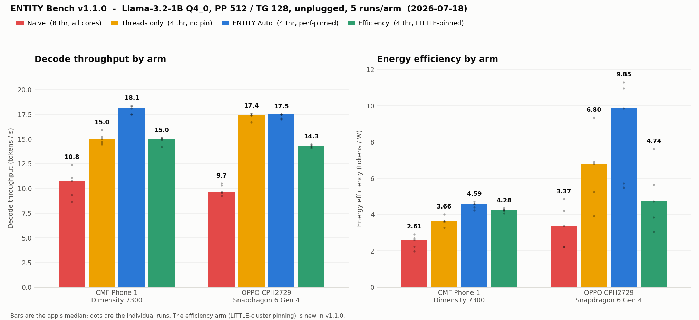
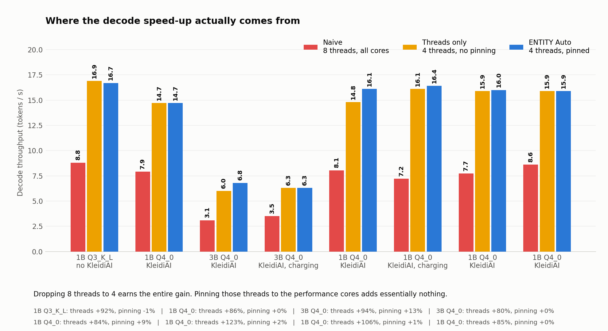
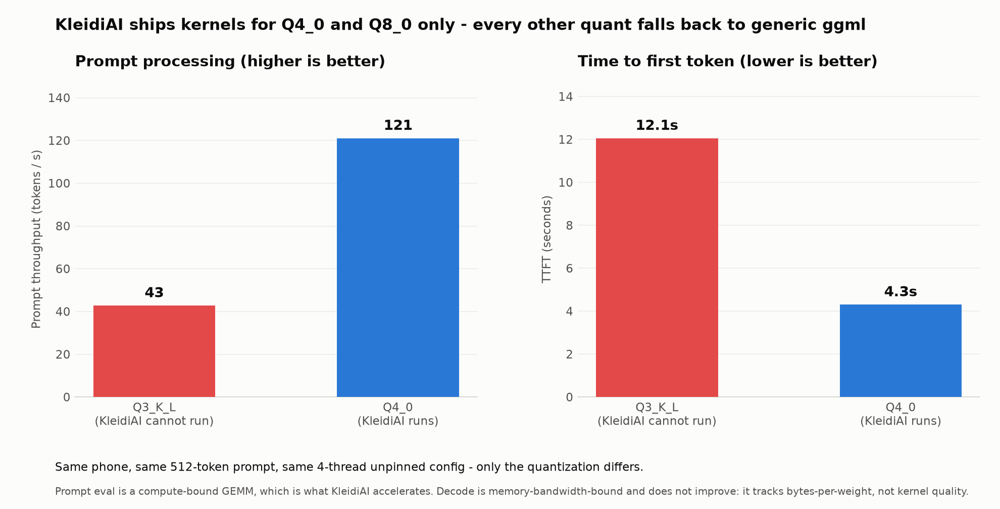
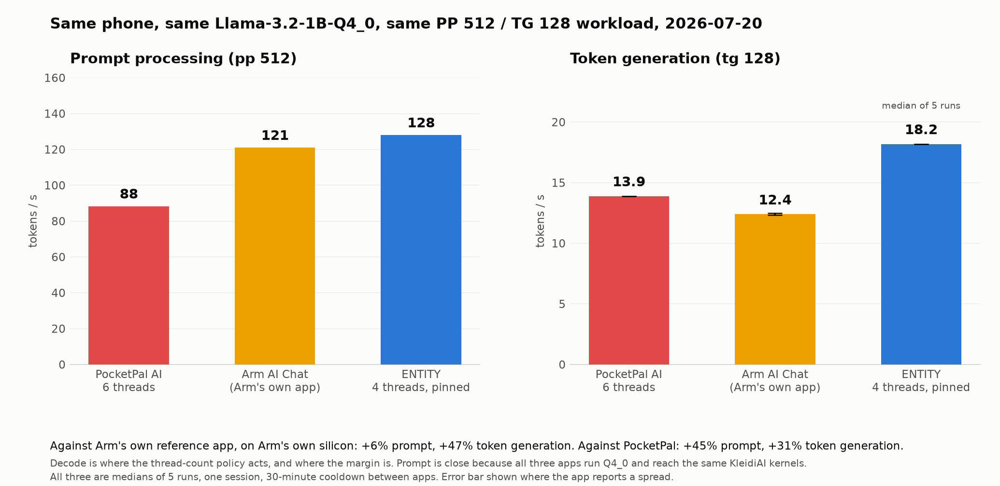

<div align="center">


# ENTITY: adaptive on device LLM runtime for Arm phones

**Fully offline Android chat that tunes llama.cpp to the Arm CPU in the phone.**

[View the source on GitHub](https://github.com/kkjjkamal123/ENTITY---Arm-Create-AI-Optimization-Challenge) · [Read the complete Arm Create submission](github.md)


</div>

## Navigation

[Home](README.md) · [Evidence](benchmarks/REPRODUCIBILITY.md) · [Comparisons](benchmarks/COMPARISONS.md) · [Benchmarks](benchmarks/BENCHMARKS.md) · [Optimization](docs/OPTIMIZATIONS.md) · [FAQ](docs/FAQ.md) · [Starter kit](templates/arm64-android-runtime/README.md) · [Contributing](docs/CONTRIBUTING.md) · [License](LICENSE)

## What ENTITY is

ENTITY is a private Android assistant that runs runnable GGUF language models entirely on the phone. It is built as an inference optimization layer around llama.cpp with a Kotlin interface and a C++ JNI inference path.

The current release is built for arm64 Android phones running Android 13 or later. It has been measured on a CMF Phone 1 with MediaTek Dimensity 7300 and independently validated on a Qualcomm Snapdragon 6 Gen 4 phone.

## What makes it different

| Runtime decision | What ENTITY does |
|---|---|
| CPU backend | Ships seven Arm CPU backend variants from Arm v8.0 through Arm v9.2. ggml loads the best supported variant at startup. |
| KleidiAI advisor | Arm's KleidiAI has kernels for Q4_0 and Q8_0 only. Every other quantization silently falls back to generic ggml. ENTITY reads the GGUF header and tells you whether the model you loaded can actually reach Arm's kernels, and what it costs when it cannot. |
| Fast core selection | Reads maximum CPU frequency from the device then ranks the cores. Auto derives its thread count from the size of the top frequency cluster (two to six cores; four on the reference 4+4 phone) and runs both inference phases there rather than waiting for the slower efficiency cores. |
| Adaptive context | Selects a 2048 to 8192 token context from model size and free RAM. This lets a 3B class model use a smaller window when memory is tight. |
| Thermal policy | Checks Android thermal status during generation and adds a small cooperative delay when heat rises. Efficiency mode doubles the delay and caps inference at two threads. |
| Energy telemetry | Reports tokens, token rate, time to first token, temperature, power, token per watt and free memory. |
| Three arm ablation | The benchmark does not just report a number, it attributes it: naive, threads only, and Auto, so a reader can see which decision earned the speed up and which did not. |

ENTITY does not claim to beat a tuned command line build on raw token rate. Its purpose is to give a normal phone user the same hardware aware decisions in a responsive foreground app with live energy and thermal information.

## Evidence at a glance

ENTITY's own ablation disproved ENTITY's flagship optimization. That is recorded here rather than buried.

| Claim | Evidence | Boundary |
|---|---|---|
| Auto is much faster than the out of the box default | Current five-run exports (2026-07-18): decode 10.8 to 18.1 tok/s (+68%) on the CMF Phone 1 and 9.7 to 17.5 tok/s (+81%) on an OPPO Snapdragon 6 Gen 4. The July record read +81% to +106% across two models. | Two phones, 1B and 3B models. Not a universal multiplier. |
| **The thread count earns the multiplier; what pinning adds is device dependent** | The threads only arm runs Auto's thread count with affinity switched off. The current five-run exports: on the Dimensity 7300 pinning adds **+21% decode** (distributions non overlapping); on the Snapdragon 6 Gen 4 it adds +1% decode but cuts median power 2.52 to 1.78 W (tok/W 6.80 to 9.85). July's three-run sets on the chat app's bench read pinning at ~0%, and the v2.0.0 claim of "+121% from big core affinity" was wrong either way - the ablation is the experiment that showed it. | Per-SoC behavior, not a universal rule. The July ~0% record is retained; the raw CSVs keep the difference answerable. |
| **KleidiAI only accelerates Q4_0 and Q8_0** | Verified in Arm's kernel source. Every benchmark published before v2.1.0 used Q3_K_L, so KleidiAI never ran. Switching to Q4_0, same phone and same thread config: prompt 43 to 121 tok/s, TTFT 12.1s to 4.3s. | Decode does not improve. It is bandwidth bound and tracks bytes per weight, not kernel quality. Q4_0 is also a quality tradeoff, so ENTITY recommends rather than switches. |
| Widening prompt processing to all cores was a regression | Prompt on 4 fast cores measures 135 tok/s; spread across all 8 it measures 86. The efficiency cores gate every GEMM. Removed in v2.1.0. | Empirical to this SoC. A tri cluster chip may prefer a wider pool, which is why the benchmark decides it, not an assumption. |
| Efficiency is measured, rather than inferred | Each pass samples battery current and voltage; watts and tok/W appear only while unplugged. Integrated over a pass, the same 128 tokens cost 86 J naive versus 50 J optimized: 42% less battery, from finishing in 11.8 s instead of 19.9 s at the same watts. | Battery current reporting is OEM dependent. Comparative on one device, not lab grade metering. |
| A developer can reproduce or challenge any of it | The app runs the ablation and exports every pass to CSV. Each arm logs the CPU mask the kernel actually applied, so a failed pin cannot pass as "pinning earns nothing". | A matching device and model are needed for a direct numerical comparison. |

This is the short judge facing map. [Benchmarks](benchmarks/BENCHMARKS.md) has the full record, the graphs, and the limits.

## Features

1. Fully offline chat with Llama 3.2 1B, Llama 3.2 3B and other runnable GGUF models.
2. In app model import through Android Storage Access Framework.
3. Streaming replies with Stop, New chat, Markdown rendering, Copy and Regenerate.
4. Persistent local conversations with restore, rename, switch and delete actions.
5. Auto mode plus manual controls for temperature, top k, top p, completion length, context and threads.
6. Live statistics and a selectable graph for token count, token rate, TTFT, temperature, power, app CPU utilization and free memory.
7. In app benchmark with a three arm ablation (naive, threads only, Auto), three run median, population standard deviation, thermal cooldown, decode attribution and CSV export. Every finished run is saved on the phone automatically, with a history screen to reopen, copy, re-export or delete any past run.
8. Light, dark and system themes plus a theme aware app icon.
9. GGUF model information including parameters, quantization, architecture and running context.

---

## Screenshots (Version <= 2.4.0)

| Chat | Benchmark | Settings |
|---|---|---|
|  |  |  |

---

## Screenshots (Version >= 3.0.0)

| Chat | Benchmark | Settings |
|---|---|---|
|  |  |  |

---

## Current in app benchmark

The benchmark runs a synthetic PP 512 / TG 128 workload on the loaded model, on an unplugged phone, with a thermal cooldown before every pass. It runs three arms, not two, so the result can be attributed rather than assumed: naive (8 threads, all cores), threads only (Auto's thread count with core pinning switched off, which is what an upstream `llama.cpp -t N` run does), and ENTITY Auto.

### Where the speed up actually comes from

The current benchmark of record is the pair of four arm, five runs per arm ENTITY Bench v1.1.0 exports taken 2026-07-18, unplugged, raw CSVs retained. The fourth arm pins Auto's threads to the LITTLE cluster to test whether the efficiency cores are actually efficient:

| Device | Naive, 8 thr | Threads only, 4 thr no pin | ENTITY Auto, 4 thr pinned | Efficiency, 4 thr LITTLE | Thread count earns | Pinning earns |
|---|---:|---:|---:|---:|---:|---:|
| CMF Phone 1, Dimensity 7300 | 10.8 ± 1.3 | 15.0 ± 0.5 | **18.1 ± 0.4** | 15.0 ± 0.3 | **+39%** | **+21%** |
| OPPO CPH2729, Snapdragon 6 Gen 4 | 9.7 ± 0.5 | 17.4 ± 0.3 | **17.5 ± 0.2** | 14.3 ± 0.1 | **+80%** | +1% |



The thread count is the universal earner. What pinning adds depends on the SoC: decode on the Dimensity (+21%, the pinned and unpinned distributions do not overlap), power on the Snapdragon (2.52 to 1.78 W median, tokens per watt 6.80 to 9.85). And on both phones the LITTLE pinned arm loses on speed and on tok/W - the efficiency cores are not an efficiency win for LLM decode, which is why the affinity policy is measured per device instead of assumed.

The July 2026 three arm record that first split the attribution, CMF Phone 1:

| Model | Naive, 8 threads | Threads only, 4 threads no pin | ENTITY Auto, 4 threads pinned | Thread count earns | Pinning earns |
|---|---:|---:|---:|---:|---:|
| Llama 3.2 1B Q3_K_L, 3 runs | 8.8 ± 0.50 | 16.9 ± 0.08 | 16.7 ± 1.3 | **+92%** | **-1%** |
| Llama 3.2 1B Q4_0, 1 run | 7.9 | 14.7 | 14.7 | **+86%** | **+0%** |
| Llama 3.2 1B Q4_0, 3 runs | 7.7 ± 0.78 | 15.9 ± 0.22 | 16.0 ± 2.1 | **+106%** | +1% |
| Llama 3.2 1B Q4_0, 3 runs (repeat) | 8.6 ± 0.82 | 15.9 ± 1.58 | 15.9 ± 0.09 | **+85%** | **+0%** |
| Llama 3.2 3B Q4_0, 1 run | 3.1 | 6.0 | 6.8 | **+94%** | +13% |
| Llama 3.2 3B Q4_0, 1 run | 3.5 | 6.3 | 6.3 | **+81%** | **+0%** |



Eight threads on a 4+4 big.LITTLE phone let the Cortex A55s gate every decode step. Using four threads removes that. In this July record the pinning added nothing measurable - identical 15.9 tok/s medians pinned and unpinned in the repeat set, with the pinned arm's spread collapsing from 1.58 to 0.09, so pinning bought repeatability rather than speed. The 2026-07-18 five run exports above are the current statement - +21% on this same phone, +1% on the OPPO - and the difference between the two records is kept as an open question in [the benchmark record](benchmarks/BENCHMARKS.md). What every set agrees on: the v2.0.0 claim that +121% came from big core affinity was wrong, and ENTITY's own ablation is what proved it.

### KleidiAI never ran

Arm's KleidiAI ships matmul kernels for Q4_0 and Q8_0 only. Every other quantization, including the whole K quant family, falls back to generic ggml no matter which backend variant loaded. Every benchmark published before v2.1.0 used Q3_K_L, so Arm's kernels never executed. The fallback is silent; a one-time upstream warning is contributed in [llama.cpp PR #25701](https://github.com/ggml-org/llama.cpp/pull/25701) (approved by the KleidiAI backend maintainer and a second reviewer on 2026-07-21, awaiting merge), and the full write-up is in [Which GGUF quant actually reaches KleidiAI](docs/KLEIDIAI-QUANTS.md).

Same phone, same 512 token prompt, same four thread unpinned config. Only the quantization differs:

| | Q3_K_L, KleidiAI cannot run | Q4_0, KleidiAI runs | Change |
|---|---:|---:|---:|
| Prompt throughput | 42.7 tok per s | **121 tok per s** | **+183%** |
| Time to first token | 12050 ms | **4299 ms** | **-64%** |
| Decode throughput | 16.9 tok per s | 14.7 tok per s | -13% |



Prompt evaluation is a compute bound GEMM, which is what KleidiAI accelerates. Decode is memory bandwidth bound and tracks bytes per weight rather than kernel quality, so it does not improve: Q4_0 is about 6% more bytes and lands slightly slower. Q4_0 is also a quality tradeoff, so ENTITY recommends it rather than switching silently.

### What the user actually gets

Llama 3.2 1B, ENTITY Auto, unplugged:

| | v2.0.0, Q3_K_L, prompt widened to all cores | v2.1.0, Q4_0, prompt on the fast cores |
|---|---:|---:|
| Prompt throughput | 38.3 tok per s | **133 tok per s** |
| **Time to first token** | **13440 ms** | **3918 ms** |
| Decode throughput | 16.7 tok per s | 14.7 tok per s |

Time to first token, the latency a user feels on a long prompt, drops 3.4 times. Decode gives up about 12%, the bandwidth cost of the larger quantization, and the benchmark screen shows both sides of the trade.

### Against the competition

Same phone, same `Llama-3.2-1B-Instruct-Q4_0`, same PP 512 / TG 128 workload, all three apps' own benchmark screens. All three re-measured in one session on 2026-07-20, five runs each, 30 minute cooldown between apps:

| App | Prompt | Token generation | Threads |
|---|---:|---:|---|
| PocketPal AI | 88.32 tok per s | 13.9 tok per s | 6 |
| Arm AI Chat (Arm's own app) | 121 tok per s | 12.4 tok per s | not reported |
| **ENTITY** | **128 tok per s** | **18.2 tok per s** | 4, pinned |



Against Arm's own reference app, on Arm's own silicon: 6% on prompt and **47% on token generation**. Against PocketPal: 45% and 31%. Decode is where the thread count policy acts and where the margin is; the prompt column is close because all three apps run Q4_0 and reach the same KleidiAI kernels.

The same three apps were measured on 2026-07-14 and the repeat did not agree with it. PocketPal and Arm swapped places on decode, and ENTITY's prompt margin over Arm narrowed from 11% to 6%. Both sessions are published with their dates, because PocketPal's decode swinging about 27% between sessions on identical hardware, while Arm's held within about 4%, is exactly why a figure from one session must never be paired with a figure from another. Full setup, both sessions, screenshots and caveats: [competitor comparison](benchmarks/competitor-comparison/README.md).

TTFT here is derived from prompt evaluation plus one decode step. It is not a live chat first token measurement. Full method, the historical two arm v2.0.0 record, and every limit: [benchmarks](benchmarks/BENCHMARKS.md).

The same ablation now ships as a standalone app, [ENTITY Bench](app/entity.bench.android/README.md), so a developer can run it on their own SoC and contribute a device row without installing the full chat app.

## Get started

Ninety seconds from clone to chatting, on any arm64 phone with Android 13+:

```bash
git clone https://github.com/kkjjkamal123/ENTITY---Arm-Create-AI-Optimization-Challenge.git
cd ENTITY---Arm-Create-AI-Optimization-Challenge
adb install -r apk/ENTITY-v17-bench-history-20260721-release.apk
```

Then on the phone:

1. Download a model such as [Llama-3.2-1B-Instruct-Q4_0.gguf](https://huggingface.co/bartowski/Llama-3.2-1B-Instruct-GGUF) (Q4_0 reaches Arm's KleidiAI kernels; see [why](docs/KLEIDIAI-QUANTS.md)).
2. Open ENTITY, tap the model line in the header, choose Import from device and select the GGUF file.
3. Leave Auto mode enabled (Settings, in the menu drawer) for device aware CPU and context decisions.
4. Open BENCHMARK from the menu drawer to run the three arm ablation on the loaded model: the naive default, threads only, and the optimized path. Unplug the phone to see power and tokens per watt.

To build from source use the exact Android SDK, NDK, CMake and JDK setup in [BUILD](docs/BUILD.md). The release build is arm64 only and includes all seven CPU backend variants.

## Repository guide

The canonical source repository is [kkjjkamal123/ENTITY---Arm-Create-AI-Optimization-Challenge](https://github.com/kkjjkamal123/ENTITY---Arm-Create-AI-Optimization-Challenge).

| Location | Purpose |
|---|---|
| app/entity.android | Kotlin Android app and the native C++ inference library |
| app/entity.bench.android | Standalone benchmark app: runs the three arm ablation on any arm64 phone and exports the result to CSV |
| apk | Debug and release signed APKs |
| benchmarks | Current app measurement, historical command line results and raw records |
| docs | Architecture, build instructions, optimization details and contributor guidance |
| releases | Release notes for every version |
| scripts | Termux benchmark and chat helpers |
| screenshots | Images used in this README |
| templates | Copyable Arm64 Android runtime starter and device benchmark schema |
| github.md | Full Arm Create submission |

## Documentation

1. [Architecture](docs/ARCHITECTURE.md): UI to JNI to llama.cpp design.
2. [Build](docs/BUILD.md): reproducible toolchain and installation steps.
3. [Optimizations](docs/OPTIMIZATIONS.md): source level explanation of each runtime decision.
4. [Which GGUF quant actually reaches KleidiAI](docs/KLEIDIAI-QUANTS.md): the two types Arm's kernels accelerate, and what the rest cost.
5. [Benchmarks](benchmarks/BENCHMARKS.md): current method, cross device values, and caveats.
6. [Reproducibility](benchmarks/REPRODUCIBILITY.md): protocol, CSV evidence schema, source pointers, and evidence limits.
7. [Runtime comparisons](benchmarks/COMPARISONS.md): a fair upstream llama.cpp baseline and the requirements for any ExecuTorch or MLC-LLM claim.
8. [FAQ](docs/FAQ.md): device support, models, Auto mode, privacy, and troubleshooting answers.
9. [Arm64 Android starter kit](templates/arm64-android-runtime/README.md): copyable runtime policy, affinity helper, and retargeting checklist.
10. [Contributing](docs/CONTRIBUTING.md): project conventions and next steps.

## License

ENTITY is licensed under [Apache License 2.0](LICENSE). It builds on llama.cpp and Arm KleidiAI.
