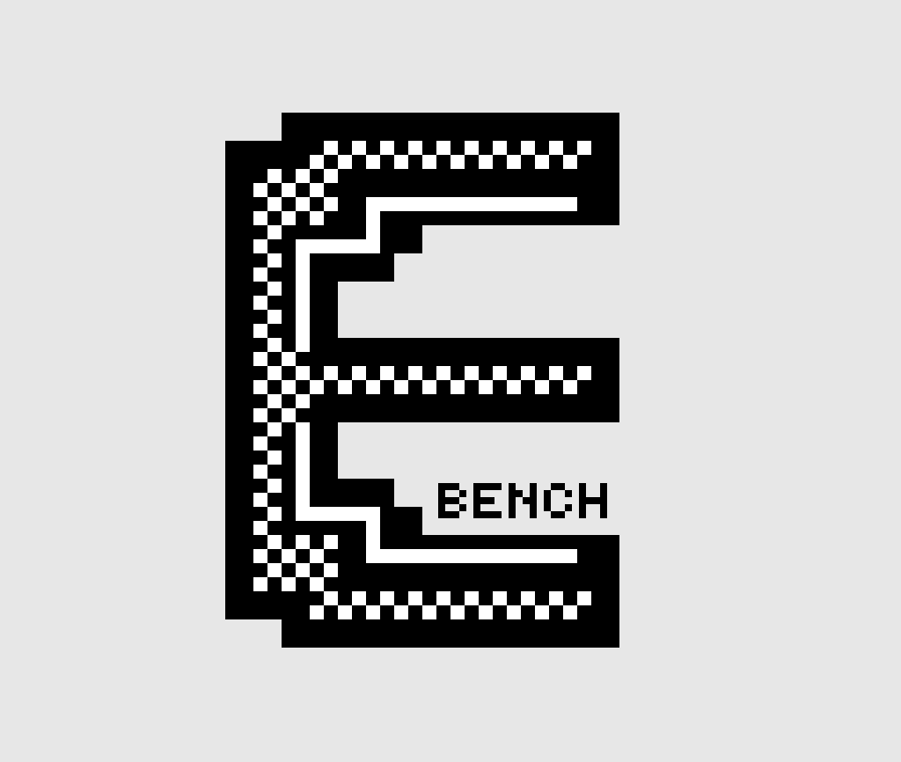

<div align="center">

<picture>
  <source media="(prefers-color-scheme: dark)" srcset="../../Icons/Bench_icon_dark.png">
  
</picture>

# ENTITY Bench: the on device LLM benchmark for Arm phones

**A dedicated, fully offline benchmark app that attributes LLM speed on the Arm CPU in the phone instead of just reporting a number.**

[View the source on GitHub](https://github.com/kkjjkamal123/ENTITY---Arm-Create-AI-Optimization-Challenge/tree/main/app/entity.bench.android) · [Read the complete Arm Create submission](../../github.md)


</div>

## Navigation

[Home](../../README.md) · [Evidence](../../benchmarks/REPRODUCIBILITY.md) · [Benchmarks](../../benchmarks/BENCHMARKS.md) · [Optimization](../../docs/OPTIMIZATIONS.md) · [Release notes](../../releases/RELEASE-Bench-v1.2.1.md) · [FAQ](../../docs/FAQ.md) · [Contributing](../../docs/CONTRIBUTING.md) · [License](../../LICENSE)

## What ENTITY Bench is

ENTITY Bench is a standalone Android app that runs one job: a controlled CPU benchmark for local GGUF language models. There is no chat. You import a model, run the ablation, and every result is saved on the device as its own page - reopenable and exportable as raw per pass CSV at any time.

It exists so that anyone with an arm64 phone can reproduce or challenge ENTITY's central finding on their own SoC: that on a 4+4 big.LITTLE phone the decode speed up comes from the thread count, not from big core pinning. A different SoC may well answer differently, which is the point of shipping the experiment rather than an assertion.

The workload is llama.cpp's synthetic bench (PP 512 / TG 128) on whatever model you load. Any GGUF architecture llama.cpp supports works: Llama, Qwen, Gemma, Phi, Mistral and the rest. The ablation compares configurations on the same loaded model, so its attribution is valid for every model family; only cross model numbers are not comparable.

## What makes it different

| Decision | What ENTITY Bench does |
|---|---|
| Attribution, not a score | Three arms - naive, threads only, auto - so the result says which decision earned the speed up. A two arm benchmark cannot separate thread count from core placement. |
| Results are records | Every finished run autosaves to device storage the moment it completes. The home screen shows the last result and recent history; All Results lists every run. Any past result reopens as a full page and exports its CSV later. |
| Controlled thermals | A cooldown before every pass: at least 15 s, up to 90 s, until the battery returns to within 0.5 C of its pre benchmark temperature. The arm order cannot favour the last arm. |
| Energy is measured | Battery current and voltage are sampled every 150 ms through each pass. Power and tokens per watt appear only while unplugged, because USB input makes the reading the charger's, not the workload's. |
| The mask is logged | Each arm records the CPU affinity the kernel actually applied, plus per core clocks during the pass, so a failed pin cannot pass as "pinning earns nothing". |
| Efficiency core arm | An optional fourth arm pins auto's thread count to the slowest cluster. It answers a tok/W question: are the little cores actually more energy efficient for decode, or only slower? |
| Sustained mode | 2 / 5 / 10 minutes of back to back passes with no cooldown, threads only vs auto, to see who throttles first once the SoC is hot. |
| Thread sweep | Every thread width the device can use, each one pinned and again scheduler placed, with the winning configuration named. The ablation asks whether the shipped policy beats the phone's default; the sweep asks whether it is the best that phone can do - and answers per device, because clock frequency alone cannot tell a slow core from a narrow one. |
| Nothing leaves the phone | No network, no accounts. Results live in app private storage until you export or delete them. |

## Screenshots

| Home | Full result |
|---|---|
|  |  |

A real single run ablation on the reference phone (CMF Phone 1, Dimensity 7300): decode +63% vs naive, of which +60% comes from dropping 8 threads to 4 and +2% from pinning those threads to the performance cores. The efficiency core arm below the table shows the little cores decoding at 13.9 tok/s against auto's 17.8.

The interface is two colors, pure black and pure white, inverted between the dark and light themes - selectable in Settings (System / Light / Dark). Square corners, monospace, no shades: a lab instrument, not a dashboard.

## The three arms

The benchmark runs the same synthetic PP 512 / TG 128 workload three ways on the loaded model, with the same cooldown before every pass:

| Arm | Configuration |
|---|---|
| naive | 8 threads across all online cores. The out of the box default. |
| threads only | The same thread count auto derives, with affinity off: no `sched_setaffinity`, no pinned pool, placement left to the Linux scheduler. This is what an upstream `llama.cpp -t N` run does. |
| auto | The shipped path: both phases on the fast core thread count, pinned to the performance cluster. |

naive and auto differ in two variables at once, thread count and core placement, so a two arm result cannot say which one earned the gain. The middle arm holds the thread count at auto's value and drops only the affinity, so:

- naive to threads only isolates the thread count
- threads only to auto isolates the core pinning

The result page prints that split as its headline. The current benchmark of record is this app's own output: two four arm, five runs per arm exports taken 2026-07-18 (Llama 3.2 1B Q4_0, unplugged, raw CSVs in [`benchmarks/results/`](../../benchmarks/results/)):

| Device | Naive, 8 thr | Threads only, no pin | Auto, pinned | Efficiency, LITTLE | Thread count earns | Pinning earns |
|---|---:|---:|---:|---:|---:|---:|
| CMF Phone 1, Dimensity 7300 | 10.8 ± 1.3 | 15.0 ± 0.5 | **18.1 ± 0.4** | 15.0 ± 0.3 | **+39%** | **+21%** |
| OPPO CPH2729, Snapdragon 6 Gen 4 | 9.7 ± 0.5 | 17.4 ± 0.3 | **17.5 ± 0.2** | 14.3 ± 0.1 | **+80%** | +1% |


The thread count earns the multiplier on both devices. What pinning adds is device dependent: decode on the Dimensity (+21%, non overlapping distributions), power on the Snapdragon (2.52 to 1.78 W median, tok/W 6.80 to 9.85). This same ablation, in its earlier three arm form, is what disproved ENTITY's own "+121% from big core affinity" claim - the July sets read pinning at ~0% and are retained in [the benchmark record](../../benchmarks/BENCHMARKS.md).

The optional fourth arm, **efficiency cores**, inverts auto's placement to the slowest cluster and exports with the `affinity_efficiency` label. Measured on both phones it answers its tok/W question with a no: LITTLE pinning is slower *and* worse per watt than the pinned performance cores (and on the CMF it collapses prompt speed 139 to 82.5 tok/s), so the efficiency cores are not an efficiency win for LLM inference.

## Thread sweep

The ablation answers whether the shipped policy beats the phone's default. It cannot answer whether the shipped policy is the *best that phone can do*, because every arm runs one thread width. The sweep runs them all - 2 / 4 / 6 / 8 capped at the core count, plus whatever auto derives - each width pinned to that many of its fastest cores and again left to the scheduler, then names the configuration that won.

That matters because the thread count is derived from clock frequency, and clock frequency cannot distinguish a slow core from a narrow one:

| Device | Second tier vs top clock | Right answer |
|---|---|---|
| CMF Phone 1 | Cortex A55 @ 2000 vs A78 @ 2500 = **80%** | exclude - an A55 is roughly a third of an A78's throughput |
| Galaxy S26 Ultra | mid @ 3628 vs prime @ 4742 = **76%** | different case entirely - both are performance class |

Nearly identical ratios, and no frequency threshold separates them. Rather than ship a table of core part numbers that ages with every new SoC, the app measures the device in front of it. A pinned/no pin pair at one width isolates placement while the column isolates width, so a sweep is a two dimensional ablation rather than a single line through one.

Best is chosen on decode, which is what a chat user waits on token by token; the prompt and tok/W columns are printed beside it and are allowed to disagree. A sweep is widths x 2 placements x runs, each with a full cooldown, so the app states the pass count and rough duration before it starts.

## Sustained mode

The controlled benchmark cools back to baseline before every pass by design, so it cannot see what happens under accumulated heat. Sustained mode runs back to back passes for a selectable 2 / 5 / 10 minutes per arm with only a 2 s gap, threads only vs auto, both blocks starting from the same cooled baseline. If pinning only pays off once the little cores have heated up and started throttling, this is where it shows. Read the trend across passes, not any single one.

## Features

1. Fully offline benchmark for any runnable GGUF model: Llama, Qwen, Gemma, Phi, Mistral and other llama.cpp supported architectures.
2. In app model import through Android Storage Access Framework; a KleidiAI badge on the model row tells you whether the chosen quantization reaches Arm's kernels (Q4_0 / Q8_0) or falls back to generic ggml.
3. Device under test card: core topology, ABI, temperature, free RAM, and whether the kernel reports battery current at all.
4. Live run screen: per arm status, cooldown countdown, progress bar, live battery temperature, power draw, thermal status and app CPU, with the screen held on and an abort button.
5. Every result autosaved with history; any past run reopens as a full result page.
6. Result page: headline attribution, decode bars, the full metric table (prompt, decode, derived TTFT, power, tok/W, app CPU, per cluster clocks, RAM floor, temperatures, peak thermal status), methodology notes, Copy, Export CSV, Delete.
7. Raw per pass CSV export with device fingerprint, app version, thermal record, 150 ms telemetry samples, per core clock traces and the applied CPU mask per arm. Row keys are unchanged from v1.0.0, so existing analysis scripts keep working.
8. Thread sweep mode: every usable thread width, pinned and scheduler placed, with the winning configuration named and a run length estimate before it starts.
9. Pure black and white theme with System / Light / Dark selection in Settings.

## Run a valid benchmark

The numbers are only comparable if the run conditions match the ones in [Benchmarks](../../benchmarks/BENCHMARKS.md):

1. **Unplug the phone.** Power and tokens per watt are hidden while charging by design. Speed numbers stay valid while charging; power does not.
2. **Start cool.** Let the phone sit at rest so the battery is near ambient. The app cools back toward the pre benchmark temperature before every pass, but a hot start still biases the first arm.
3. **Choose 3 runs, not 1.** A single pass swings roughly +/-15%; the median of three is what the published rows use.
4. **Let the cooldowns finish.** Do not interrupt the pauses between passes; they are the control that makes the arms comparable.

The app runs a discarded warm up, then naive, threads only and auto in that order, with the same cooldown before every pass so the ordering cannot favour the last arm.

## Export a CSV and contribute a row

Open any result, fresh or from history, and tap **Export CSV**. To contribute your device's result:

1. Fill one row in [`benchmarks/device-result-template.csv`](../../benchmarks/device-result-template.csv), matching its header (app version, SoC, model, quantization, charging state, thermal start, and the per arm speed and power columns).
2. Commit your raw exported CSV beside it and reference it in the `raw_csv_path` column.

See the "Contribute a device result" section of [Benchmarks](../../benchmarks/BENCHMARKS.md) for the full convention. Keep the model, quantization, app version, backend, thermal start and charging state with the row; nothing is back filled from another run.

## Get started

Ninety seconds from clone to a saved result, on any arm64 phone with Android 13+:

```bash
git clone https://github.com/kkjjkamal123/ENTITY---Arm-Create-AI-Optimization-Challenge.git
cd ENTITY---Arm-Create-AI-Optimization-Challenge
adb install -r apk/ENTITY-Bench-v1.2.1-release.apk
```

Then on the phone:

1. Download a model such as [Llama-3.2-1B-Instruct-Q4_0.gguf](https://huggingface.co/bartowski/Llama-3.2-1B-Instruct-GGUF) (Q4_0 reaches Arm's KleidiAI kernels; see [why](../../docs/KLEIDIAI-QUANTS.md)). It does not need the chat app.
2. Open ENTITY Bench, tap the model field and import the GGUF from device storage.
3. Unplug, pick 3 runs, and tap RUN BENCHMARK. The result page opens - and stays - when it finishes.

## Build from source

Like the main app, ENTITY Bench cannot build standalone: its native `CMakeLists.txt` does `add_subdirectory()` six directory levels up, so the app must sit inside a llama.cpp checkout at `examples/entity.bench.android/`.

```bash
curl -sL -o llama.tar.gz https://github.com/ggml-org/llama.cpp/archive/refs/heads/master.tar.gz
tar xzf llama.tar.gz                                          # -> llama.cpp-master/
cp -r app/entity.bench.android llama.cpp-master/examples/entity.bench.android
cd llama.cpp-master/examples/entity.bench.android
./gradlew :app:assembleRelease --no-daemon --console=plain
```

The APK lands at `app/build/outputs/apk/release/app-release.apk`. Without a `keystore.properties`, the release build falls back to the debug signing key. The toolchain (JDK 17, NDK 27.1.12297006, CMake 3.31.6, Android SDK 36) is the same one documented in [BUILD](../../docs/BUILD.md); the first build compiles llama.cpp itself and takes several minutes.

## Documentation

1. [Benchmarks](../../benchmarks/BENCHMARKS.md): current method, cross device values, and caveats.
2. [Reproducibility](../../benchmarks/REPRODUCIBILITY.md): protocol, CSV evidence schema, source pointers, and evidence limits.
3. [Optimizations](../../docs/OPTIMIZATIONS.md): source level explanation of each runtime decision the arms test.
4. [Which GGUF quant actually reaches KleidiAI](../../docs/KLEIDIAI-QUANTS.md): the two types Arm's kernels accelerate, and what the rest cost.
5. [Release notes for v1.2.1](../../releases/RELEASE-Bench-v1.2.1.md) and [v1.2.0](../../releases/RELEASE-Bench-v1.2.0.md): what each release changed and what it deliberately kept.
6. [ENTITY chat app](../../README.md): the assistant these optimizations ship in.

## License

ENTITY Bench is licensed under [Apache License 2.0](../../LICENSE). It builds on llama.cpp and Arm KleidiAI.
