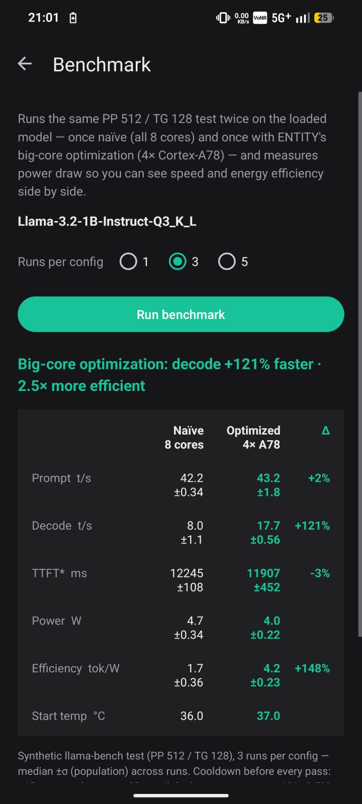
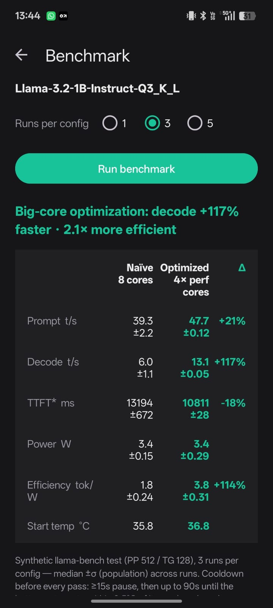

# ENTITY v2.0.0 benchmark record

This is the one canonical benchmark document for ENTITY. It reports the benchmark path that ships
in the Android app. The public source is [kkjjkamal123/ENTITY---Arm-Create-AI-Optimization-Challenge](https://github.com/kkjjkamal123/ENTITY---Arm-Create-AI-Optimization-Challenge).

## What was measured

The in-app benchmark loads `Llama-3.2-1B-Instruct-Q3_K_L` and runs a synthetic llama-bench
workload of PP 512 and TG 128. Each configuration runs three times on an unplugged phone. Values
are median plus population standard deviation.

| Path | Configuration |
|---|---|
| Naïve | Eight threads across all online CPU cores. |
| ENTITY Auto | CPU cores are ranked by maximum frequency. Decode uses the fastest two to four cores while prompt processing can use all online cores through the split thread pools. |

The benchmark samples battery current and voltage during every pass. `PowerMath` resolves OEM
microamp versus milliamp reporting before calculating watts and tokens per watt. It hides power
and efficiency when the phone is charging. TTFT is a benchmark-derived estimate from prompt
evaluation plus one decode step, not a live-chat first-token measurement.

## Results

| Device | Metric | Naïve | ENTITY Auto | Change |
|---|---|---:|---:|---:|
| CMF Phone 1, Dimensity 7300 | Prompt throughput | 42.2 ± 0.34 tok/s | 43.2 ± 1.8 tok/s | +2% |
|  | Decode throughput | 8.0 ± 1.1 tok/s | 17.7 ± 0.56 tok/s | +121% |
|  | Derived TTFT | 12,245 ± 108 ms | 11,907 ± 452 ms | 3% lower |
|  | Power | 4.7 ± 0.34 W | 4.0 ± 0.22 W | lower |
|  | Energy efficiency | 1.7 ± 0.36 tok/W | 4.2 ± 0.23 tok/W | 2.5× |
| OPPO CPH2729, Snapdragon 6 Gen 4 | Prompt throughput | 39.3 ± 2.2 tok/s | 47.7 ± 0.12 tok/s | +21% |
|  | Decode throughput | 6.0 ± 1.1 tok/s | 13.1 ± 0.05 tok/s | +117% |
|  | Derived TTFT | 13,194 ± 672 ms | 10,811 ± 28 ms | 18% lower |
|  | Power | 3.4 ± 0.15 W | 3.4 ± 0.29 W | flat |
|  | Energy efficiency | 1.8 ± 0.24 tok/W | 3.8 ± 0.31 tok/W | 2.1× |

| Mediatek | Snapdragon |
|---|---|
|  |  | 

## Interpretation and limits

The repeatable result is that frequency-ranked fast-core decode improves both speed and energy
efficiency on two Arm SoCs with the same app, model, and test protocol. It does not establish a
universal performance multiplier for every phone, model, quantization, temperature, or background
workload. The numbers are benchmark values rather than live multi-turn-chat speed.

## Reproduce

Follow the exact [reproducibility protocol](REPRODUCIBILITY.md). In short: install the current
APK, load the stated Q3_K_L model, unplug and cool the phone, select three runs in **Benchmark**,
then export the CSV. The app performs a discarded warm-up, runs naïve before Auto, records every
pass, and applies a thermal cooldown before each pass.

### Evidence status
    
[`device-result-template.csv`](device-result-template.csv) is the machine-readable summary behind
the two published tables. It intentionally marks its `raw_csv_path` fields as `not-recorded`:
the original per-pass Android CSV exports for the v2.0.0 reference runs were not retained, so they
cannot be reconstructed honestly from a median and standard deviation. The checked-in
[`proof-logs/entity_results.txt`](proof-logs/entity_results.txt) and
[`termux_master_results.txt`](termux_master_results.txt) are historical CLI evidence with a
different workload and, in the optimized CLI case, realtime priority; neither is substituted for
the app result.

New app exports contain per-pass values plus app/device/ABI/version, benchmark order, warm-up and
cooldown provenance. Commit those CSVs beside a new device-result row when contributing a result.

## Contribute a device result

Use [device-result-template.csv](device-result-template.csv) for a result from another arm64
Android phone. Keep the model, app version, selected backend, thermal starting point, raw CSV, and
test settings with the row. This makes a community result comparable without claiming that every
SoC will produce the same multiplier.

## Historical command-line data

[`termux_master_results.txt`](termux_master_results.txt) retains the original Termux CLI output.
It uses a different workload and includes CLI-only realtime priority in its optimized path. It is
useful background evidence but is not part of the Android app performance claim above.
