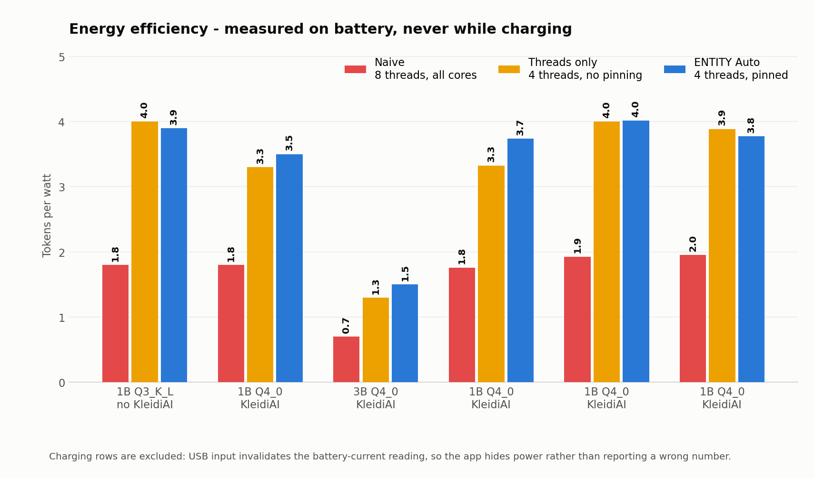
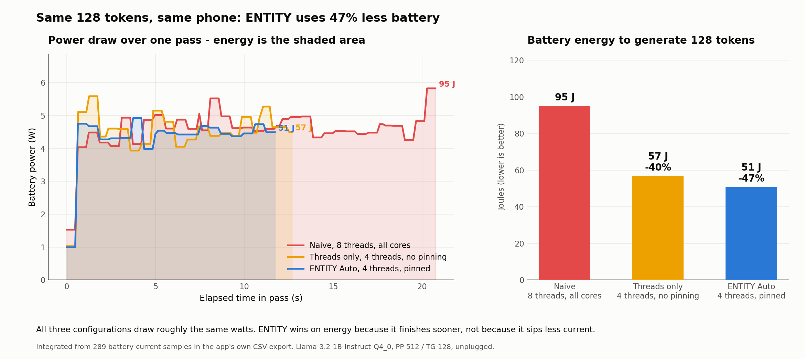

# ENTITY v2.1.0 benchmark record

This is the one canonical benchmark document for ENTITY. It reports the benchmark path that ships
in the Android app. The public source is [kkjjkamal123/ENTITY---Arm-Create-AI-Optimization-Challenge](https://github.com/kkjjkamal123/ENTITY---Arm-Create-AI-Optimization-Challenge).

**The headline finding is not the one this project started with.** ENTITY's in-app ablation
disproved its own flagship optimization. The +121% decode figure published for v2.0.0 was credited
to big-core affinity pinning. It is not: the pinning earns approximately nothing. The gain comes
from using four threads instead of eight. That result, and the two optimizations that *do* pay on
Arm, are recorded below.

## What was measured

The in-app benchmark runs a synthetic llama-bench workload of PP 512 and TG 128 on the loaded
model. Each configuration runs on an unplugged phone, with a thermal cooldown before every pass.
Values are median (± population standard deviation where more than one run was taken).

| Arm | Configuration |
|---|---|
| Naïve | Eight threads across all online CPU cores. The out-of-the-box default. |
| Threads only | The same thread count Auto derives, with affinity off: no `sched_setaffinity`, no pinned thread pool, placement left to the Linux scheduler. This is what an upstream llama.cpp `-t N` run does. |
| ENTITY Auto | CPU cores are ranked by maximum frequency; both phases run on the fastest two to four cores. |

### Why three arms

Naïve and Auto differ in two variables at once: thread count and core placement. A two-arm result
cannot say which one earns the speed-up. The threads-only arm holds the thread count at Auto's
value and removes only the affinity, so:

- naïve → threads-only isolates **the thread count**
- threads-only → Auto isolates **the core pinning**

Both the decode and prompt rows are clean ablations, because every arm now runs both phases on the
same thread count. The app prints the split under its own results table.

Each arm logs the CPU mask the kernel actually applied (`effective cpus` in logcat), so a failed
`sched_setaffinity` cannot masquerade as "pinning earns nothing". See
[REPRODUCIBILITY](REPRODUCIBILITY.md).

## Result 1: the thread count earns the gain, the pinning does not

CMF Phone 1 (Nothing A015), MediaTek Dimensity 7300, 4× Cortex-A78 + 4× Cortex-A55, Android 16.
Decode throughput, tokens/s:

| Model | Naïve (8 thr) | Threads only (4 thr, no pin) | ENTITY Auto (4 thr, pinned) | Thread count earns | Pinning earns |
|---|---:|---:|---:|---:|---:|
| Llama-3.2-1B Q3_K_L (3 runs) | 8.8 ± 0.50 | 16.9 ± 0.08 | 16.7 ± 1.3 | **+92%** | **−1%** |
| Llama-3.2-1B Q4_0 (1 run) | 7.9 | 14.7 | 14.7 | **+86%** | **+0%** |
| Llama-3.2-1B Q4_0 (3 runs, 2026-07-15) | 7.7 ± 0.78 | 15.9 ± 0.22 | 16.0 ± 2.1 | **+106%** | +1% |
| Llama-3.2-3B Q4_0 (1 run) | 3.1 | 6.0 | 6.8 | **+94%** | +13% |
| Llama-3.2-3B Q4_0 (1 run) | 3.5 | 6.3 | 6.3 | **+81%** | **+0%** |


Running eight threads on a 4+4 big.LITTLE phone lets the Cortex-A55s gate every decode step. Simply
using four threads removes that, and it is most of what `llama.cpp -t 4` already gives any user who
bothers to pass the flag.

**Pinning those four threads to the performance cluster adds nothing measurable.** The two 3B runs
disagree (+13% and +0%), and a third 3B run taken while charging measured −16%; single 3B runs swing
about ±15%, so the +13% is not a finding. Across every run the honest number is ~0%.

The affinity code still ships, because it costs nothing and a different SoC may behave differently.
It is no longer claimed as the source of the speed-up.

## Result 2: KleidiAI only accelerates Q4_0 and Q8_0

Arm's KleidiAI registers matmul kernels for exactly two GGML types, `Q4_0` and `Q8_0`
(`ggml/src/ggml-cpu/kleidiai/kleidiai.cpp`). Every other type — including the whole K-quant and IQ
family — falls back to generic ggml kernels, no matter which of the seven CPU backend variants was
loaded at startup.

**Every benchmark ENTITY published before v2.1.0 used Q3_K_L, so KleidiAI never executed once.**

Same phone, same 512-token prompt, same four-thread unpinned configuration — only the quantization
differs:

| | Q3_K_L (KleidiAI cannot run) | Q4_0 (KleidiAI runs) | Change |
|---|---:|---:|---:|
| Prompt throughput | 42.7 tok/s | **121 tok/s** | **+183%** |
| Derived TTFT (512-token prompt) | 12,050 ms | **4,299 ms** | **−64%** |
| Decode throughput | 16.9 tok/s | 14.7 tok/s | −13% |


This is exactly what the hardware predicts, which is why it is trustworthy:

- **Prompt evaluation is a compute-bound GEMM.** It is what KleidiAI's i8mm/dotprod kernels are
  built for, so it nearly triples.
- **Decode is memory-bandwidth-bound.** It tracks bytes-per-weight, not kernel quality. Q4_0 is
  773 MB against Q3_K_L's 733 MB — about 6% more bytes — and lands about 6-13% slower. Kernel
  quality cannot help a workload that is waiting on memory.

Q4_0 is a quality tradeoff as well as a speed one, so ENTITY **recommends** rather than silently
switches: the model-info card now reports whether the loaded quantization can reach KleidiAI, and
what it costs when it cannot.

## Result 3: widening prompt processing to all cores was a regression

Until v2.1.0, Auto used split thread pools: generation on the fast cores, prompt processing widened
to *every* online core, on the assumption that prompt eval is compute-bound and therefore wants all
the hardware.

Measured, that assumption is wrong. An A55 is roughly a third of an A78's throughput, so the
widened pool finishes its share late and every GEMM waits on the stragglers:

| Prompt throughput, 1B Q4_0, ENTITY Auto | tok/s |
|---|---:|
| Prompt widened to all 8 cores (v2.0.0 behaviour) | 86 |
| Prompt on the 4 fast-core threads (v2.1.0) | **135** |

Both phases now run on the fast-core thread count. The right width is an empirical property of the
SoC, not a constant — a tri-cluster chip may prefer something else, and the in-app benchmark is what
should decide it.

## Combined effect on the user

Llama-3.2-1B, ENTITY Auto, CMF Phone 1, unplugged:

| | v2.0.0 (Q3_K_L, widened prompt pool) | v2.1.0 (Q4_0, fast-core prompt) |
|---|---:|---:|
| Prompt throughput | 38.3 tok/s | **133 tok/s** |
| **Time to first token** | **13,440 ms** | **3,918 ms** |
| Decode throughput | 16.7 tok/s | 14.7 tok/s |
| Energy efficiency | 3.9 tok/W | 3.5 tok/W |

Time-to-first-token, the latency a user actually feels on a long prompt, drops by **3.4×**. Decode
gives up about 12%, which is the bandwidth cost of the larger quantization — a deliberate trade,
and the benchmark screen shows both sides of it.



## Result 4: the same work costs 47% less battery

Tokens-per-watt is the metric every on-device app quotes, and it undersells what is happening. The
app's CSV export records the battery current every 150 ms, so the *energy* a pass actually cost can
be integrated from the measured power curve rather than inferred.



| Arm | Pass duration | Mean power | **Energy for 128 tokens** |
|---|---:|---:|---:|
| Naïve (8 threads) | 20.8 s | 4.57 W | **95 J** |
| Threads only | 12.7 s | 4.45 W | **57 J** (−40%) |
| **ENTITY Auto** | **11.7 s** | 4.31 W | **51 J** (−47%) |

**All three configurations draw roughly the same watts.** ENTITY does not win by sipping less
current — it wins because it finishes in half the time. Energy is the area under the power curve,
which is why the left panel of that figure is a literal picture of the right one.

Integrated by trapezoid from 289 battery-current samples in
[`results/entity_1b-q4_0_unplugged_1run_20260714.csv`](results/entity_1b-q4_0_unplugged_1run_20260714.csv):

```bash
python3 benchmarks/plot_energy.py benchmarks/results/entity_1b-q4_0_unplugged_1run_20260714.csv
```

The script refuses to run on a charging export, because the battery current would be the charger's
rather than the workload's.

## Against other apps

ENTITY was measured against Arm's own AI Chat and PocketPal AI on the same phone, the same GGUF and
the same PP 512 / TG 128 workload: **prompt 133 vs 120 vs 86.4 tok/s, token generation 15.6 vs 12.9
vs 10.9 tok/s.** ENTITY beats Arm's own reference app on Arm's own silicon.

PocketPal runs 6 threads and comes last, which is the same failure this document's naive arm
measures — the fifth and sixth threads land on Cortex-A55s and every step waits on them.

Setup, screenshots, and the caveats (including why ENTITY's live-chat 16.9 tok/s is *not* used):
[competitor-comparison/](competitor-comparison/README.md).

## Interpretation and limits

- One phone, two models, one quantization pair. Not a universal multiplier.
- The 1B Q3_K_L row is three runs; the Q4_0 rows are single runs, so their sd columns are 0 and not
  meaningful. Treat the single-run figures as indicative, and the ±15% swing seen across the 3B runs
  as the noise floor for one pass.
- These are synthetic benchmark values, not live multi-turn chat speed.
- Power and tokens-per-watt are recorded only while unplugged; the app hides them while charging
  because USB input invalidates the battery-current reading.

## Historical two-arm record (v2.0.0)

These are the originally published numbers. They are correct as measurements and wrong as an
attribution: they compare naïve against Auto, which differ in both thread count and placement, so
nothing in them can be credited to core pinning.

| Device | Metric | Naïve | ENTITY Auto | Change |
|---|---|---:|---:|---:|
| CMF Phone 1, Dimensity 7300 | Decode throughput | 8.0 ± 1.1 tok/s | 17.7 ± 0.56 tok/s | +121% |
|  | Energy efficiency | 1.7 ± 0.36 tok/W | 4.2 ± 0.23 tok/W | 2.5× |
| OPPO CPH2729, Snapdragon 6 Gen 4 | Decode throughput | 6.0 ± 1.1 tok/s | 13.1 ± 0.05 tok/s | +117% |
|  | Energy efficiency | 1.8 ± 0.24 tok/W | 3.8 ± 0.31 tok/W | 2.1× |

What the cross-vendor repeat *does* prove is that the **mechanism** is SoC-agnostic: ranking cores
by live `cpufreq` rather than hardcoding a mask finds the performance cluster unchanged on MediaTek
and Qualcomm. What it does not prove is that the pinning is what produced the gain.

## Reproduce

Follow the [reproducibility protocol](REPRODUCIBILITY.md). In short: install the current APK, load
the model, unplug and cool the phone, choose three runs in **Benchmark**, then export the CSV. The
app runs a discarded warm-up, then naïve, threads-only and Auto in that order, with the same thermal
cooldown before every pass so the ordering cannot favour the last arm.

Machine-readable results are in [device-result-template.csv](device-result-template.csv), one row
per run, with `kleidiai_accelerated` and `pinning_decode_delta_pct` columns. Arms that were never
run are marked `not-measured`; power on a charging run is marked `not-valid-charging`. Nothing is
back-filled from another run.

Regenerate the charts on this page with:

```bash
python3 benchmarks/plot_results.py
```

### Evidence status

The per-pass CSV exports for the v2.0.0 reference runs were never retained — and that was not
carelessness. The export was **broken**: the system file picker comes to the foreground while a
multi-gigabyte model is resident, Android kills the activity behind it, and the recreated instance
had no result to write, so it returned early while the picker had already created the file. Every
export produced a 0-byte CSV *and* a "CSV exported" toast. Fixed in v2.1.0 — the CSV is now staged
to cache before the picker opens.

**Two real exports are now retained** in [`results/`](results/), the first that ever survived:

| File | Run | Contents |
|---|---|---|
| `entity_1b-q4_0_unplugged_1run_20260714.csv` | 1B Q4_0, unplugged, 1 run | 4,046 telemetry samples, 2,312 CPU-frequency samples. Power is valid; every graph on this page comes from it. |
| `entity_1b-q4_0_charging_3run_20260714.csv` | 1B Q4_0, charging, 3 runs | 12,012 telemetry samples. Speed is valid and this is the tightest three-run evidence in the project. **Its power columns are not** — the phone was charging, so they measure the charger. Both plot scripts refuse to draw power from it. |
| `entity_1b-q4_0_unplugged_3run_20260715.csv` | 1B Q4_0, unplugged, 3 runs | 13,007 telemetry samples, app v2.2.0. The first unplugged three-run set: speed AND power both valid. Thread count +106% decode, pinning +1%. Caveat: its `affinity_naive` meta row says `pinned_fast_cores`; the naive mask is the 8 fastest of 8 cores, i.e. all of them, so the label was misleading and the CSV writer was corrected after this export. |

Exports carry per-pass values, per-core CPU frequency samples, battery temperature, thermal state,
power, and the per-arm affinity policy.

### What the three-run export says about the pinning

`entity_1b-q4_0_charging_3run_20260714.csv` is the cleanest ablation evidence recorded so far —
three passes per arm, every one at LIGHT thermal:

| Arm | Decode, per pass (tok/s) | Median |
|---|---|---:|
| Naïve | 6.94, 7.21, 7.74 | 7.21 |
| Threads only | 16.2, 16.0, 16.1 | 16.1 |
| ENTITY Auto | 16.4, 16.6, 15.7 | 16.4 |

Thread count: **+123%**. Pinning: **+1.9%** on the median — but Auto's worst pass (15.7) falls below
threads-only's worst (16.0), so the distributions overlap and the mean-to-mean difference is +0.8%.
The pinning is somewhere between 0 and +2%, inside the run-to-run noise. That is consistent with
every other run and with this document's conclusion: **the thread count earns the gain.**

## Contribute a device result

Use [device-result-template.csv](device-result-template.csv) for a result from another arm64 Android
phone, and commit the raw exported CSV beside it. Keep the model, quantization, app version,
selected backend, thermal starting point, and charging state with the row. A different SoC may well
reach a different answer about the pinning — that is the point of shipping the ablation rather than
an assertion.
