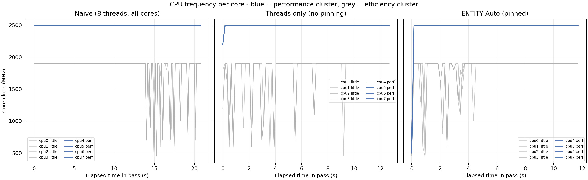
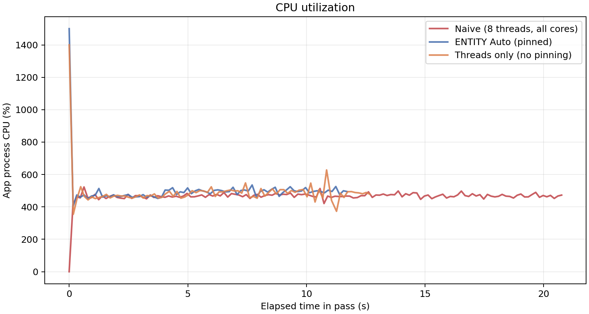
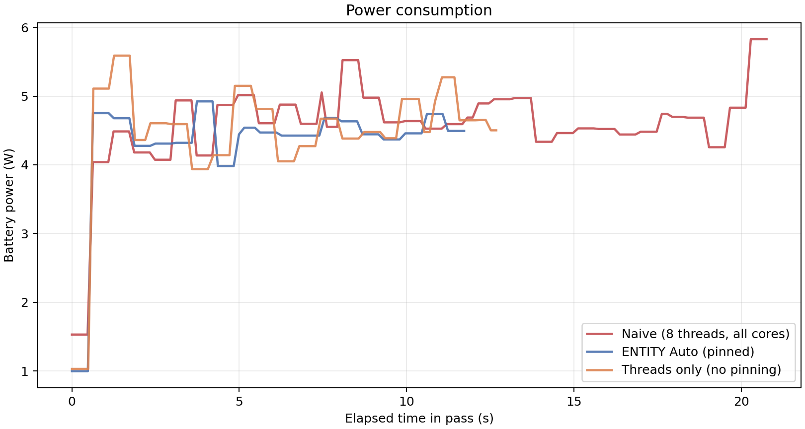
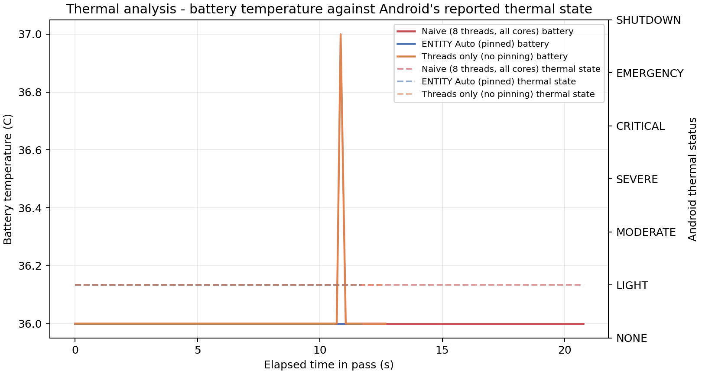
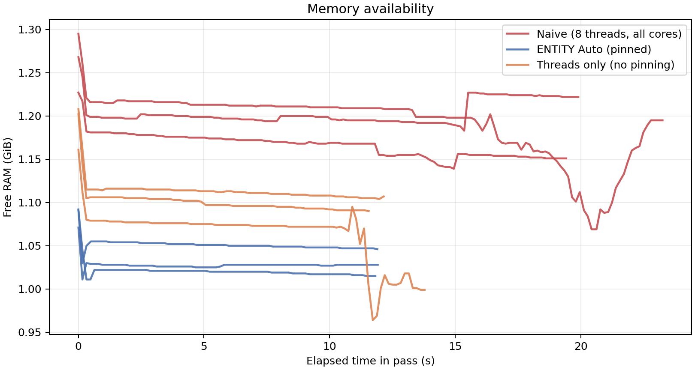
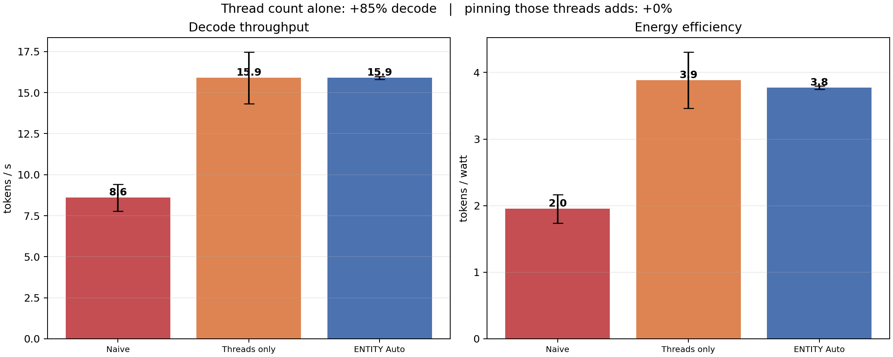
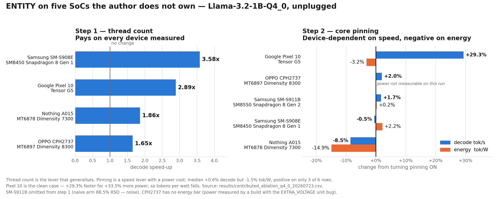

# ENTITY benchmarks - the evidence, at a glance

Everything measured in this project lives in this folder: the canonical record, every retained
raw export, every figure, and the scripts that regenerate them. This page is the index - the
graphs and the headline numbers are inlined below so nothing has to be opened one by one.

**Start here:** [BENCHMARKS.md](BENCHMARKS.md) is the full record with method, limits and history.
[REPRODUCIBILITY.md](REPRODUCIBILITY.md) is how to verify any number on your own phone.
[COMPARISONS.md](COMPARISONS.md) is how ENTITY relates to upstream llama.cpp and other apps.

---

## The current result

Two ENTITY Bench v1.1.0 exports - four arms, five runs per arm, Llama-3.2-1B Q4_0, PP 512 /
TG 128, unplugged, raw per-pass CSVs retained in [`results/`](results/):


| Device | Naive, 8 thr | Threads only, no pin | ENTITY Auto, pinned | Efficiency, LITTLE | Thread count earns | Pinning earns |
|---|---:|---:|---:|---:|---:|---:|
| CMF Phone 1, Dimensity 7300 | 10.8 ± 1.3 | 15.0 ± 0.5 | **18.1 ± 0.4** | 15.0 ± 0.3 | **+39%** | **+21%** |
| OPPO CPH2729, Snapdragon 6 Gen 4 | 9.7 ± 0.5 | 17.4 ± 0.3 | **17.5 ± 0.2** | 14.3 ± 0.1 | **+80%** | +1% |

Three findings, one figure:

1. **The thread count earns the multiplier on every device.** Eight threads let the LITTLE cores
   gate every decode step; four threads is most of the win.
2. **What pinning adds is device-dependent.** Decode on the Dimensity (+21%, distributions
   non-overlapping; tok/W 3.66 to 4.59). Power on the Snapdragon (+1% decode, but 2.52 to 1.78 W
   median - tok/W 6.80 to 9.85).
3. **The efficiency cores are not an efficiency win.** The LITTLE-pinned arm is slower *and*
   worse per watt on both phones, and on the CMF it collapses prompt speed 139 to 82.5 tok/s.

Full context, per-run numbers and the July history this supersedes:
[the current result](BENCHMARKS.md#the-current-result-four-arm-exports-entity-bench-v110-2026-07-18).

---

## Every graph in this folder

### Attribution and efficiency (from the published medians)

| | |
|---|---|
|  |  |
| **decode_attribution.png** - the July three-arm record across models: naive vs threads-only vs Auto, splitting the gain between thread count and pinning. | **energy_efficiency.png** - tokens per watt by arm; measured battery current x voltage, unplugged only. |

### The KleidiAI finding

| | |
|---|---|
|  |  |
| **kleidiai_prompt_ttft.png** - Q3_K_L vs Q4_0 on the same phone and threads: Arm's kernels only reach Q4_0/Q8_0, and prompt speed nearly triples when they do. | **energy_per_task.png** - joules for the same 128 tokens by arm: the optimized run wins by finishing sooner at similar watts, not by sipping current. |

### Per-pass telemetry (sampled every 150 ms during a run)

| | |
|---|---|
|  |  |
| **cpu_frequency.png** - per-cluster clocks during each arm; a pinned decode holds the performance cores at their ceiling while the LITTLE cores idle. | **cpu_utilization.png** - app CPU across the pass, arm by arm. |
|  |  |
| **power_consumption.png** - watts over time per arm. | **thermal_analysis.png** - battery temperature and Android thermal status over the run. |
|  |  |
| **memory_usage.png** - free-RAM floor through each pass. | **summary_comparison.png** - the one-glance roll-up of a full export. |

### Against other apps


**three_app_comparison.png** - ENTITY vs Arm's AI Chat vs PocketPal AI, same phone, same
Llama-3.2-1B Q4_0, same prompt. Screenshots of all three runs are retained beside it in
[`competitor-comparison/`](competitor-comparison/).

---

## What is in this folder

| Path | What it is |
|---|---|
| [`BENCHMARKS.md`](BENCHMARKS.md) | The canonical benchmark record: method, the current four-arm result, the July history, KleidiAI, sustained-thermal and energy results, limits. |
| [`REPRODUCIBILITY.md`](REPRODUCIBILITY.md) | How to reproduce any published number: install, protocol, what each CSV column means, how a failed pin is caught. |
| [`COMPARISONS.md`](COMPARISONS.md) | Comparison policy and results vs upstream llama.cpp and other on-device apps. |
| [`results/`](results/) | Retained, unmodified app exports - one CSV per published run (per-pass rows plus 150 ms telemetry samples). |
| [`device-result-template.csv`](device-result-template.csv) | The aggregated device-results table: one row per published run, `not-measured` where an arm was never run. Contribute your device here. |
| [`plots/`](plots/) | Every figure above, regenerated from the CSVs by the scripts below - nothing hand-drawn. |
| [`competitor-comparison/`](competitor-comparison/) | The three-app evidence: screenshots plus the comparison figure. |
| [`proof-logs/`](proof-logs/), [`termux_master_results.txt`](termux_master_results.txt) | Historical CLI-era raw logs, kept for the record and clearly separate from in-app numbers. |

## Regenerate any figure

All scripts read the retained CSVs; none invent data. Requires `python3 -m pip install matplotlib`.

| Script | Writes | Input |
|---|---|---|
| [`plot_four_arm.py`](plot_four_arm.py) | `four_arm_decode_20260718.png` | the two five-run exports in `results/` |
| [`plot_results.py`](plot_results.py) | `decode_attribution.png`, `kleidiai_prompt_ttft.png`, `energy_efficiency.png` | `device-result-template.csv` |
| [`plot_energy.py`](plot_energy.py) | `energy_per_task.png` | an unplugged export from `results/` |
| [`plot_telemetry.py`](plot_telemetry.py) | the six telemetry figures | any raw app export |
| [`plot_competitors.py`](plot_competitors.py) | `competitor-comparison/three_app_comparison.png` | the recorded three-app numbers |

### Across five SoCs (the contributed dataset, as of the committed export)



The ablation split into its two independent steps, because they behave nothing alike and the
combined figure hides that. **Step 1 (thread count) pays on every device measured**, 1.65x to
3.58x. **Step 2 (pinning) is device-dependent on speed** - the Pixel 10 is the clean cost case at
+29.3% decode for +33.5% power, so tokens per watt falls 3.2%.

Regenerate with `python3 benchmarks/plot_contributed.py`; it reads the committed CSV, not the
database. SM-S911B is omitted from step 1 (its naive arm is 88.5% RSD - noise), and CPH2737 has no
energy bar (its power came from a build with the voltage-unit bug).

**This figure is a snapshot, and the dataset has since outgrown it.** The committed CSV stops at
2026-07-23 at 12 rows / 5 SoCs; the table now holds **22 rows across 9 SoCs**, which widened step 1
to **1.34x-4.25x** and produced the first row where pinning is a clear energy *win* (+24.0% decode
at 7.9% less power). Four new SoCs, an armv8.0 Cortex-A53 device with no ISA extensions at all, and
a second power-telemetry problem are all in
[`CONTRIBUTED-DATA.md`](CONTRIBUTED-DATA.md). Re-exporting the CSV and regenerating this plot is
outstanding work; until then, read the numbers from that file or from the live leaderboard at
**<https://kkjjkamal123.github.io/ENTITY-WEB/leaderboard/>**, not from this image.

## Beyond the two development phones

- [`CONTRIBUTED-DATA.md`](CONTRIBUTED-DATA.md) - the multi-device dataset, 22 rows across 9 SoCs.
  What it established (thread tuning generalises, 1.34x-4.25x; pinning is device-dependent in both
  speed and energy, and the sign is not predictable from the spec sheet), what it falsified (the
  prefill thread width on every prime-core SoC), and the rules for reading it without overclaiming.
- [`dt_thread_rules.py`](dt_thread_rules.py) - evaluate the shipped thread-width rules against any
  SoC whose kernel device tree is upstream, **without owning the device**. The kernel computes
  `cpu_capacity` from the DT's `capacity-dmips-mhz`, and those DTs are public. Cross-checks against
  measured hardware: for SM8550 it predicts the same 2 decode threads and 5 performance cores the
  contributed Galaxy S23 reported. It validates the derivation, not the speed - only a run on the
  hardware can tell you whether a width is fast.

  ```
  python3 dt_thread_rules.py                       # built-in SoC list
  python3 dt_thread_rules.py qcom/sm8650           # any upstream DT path
  ```

## Add your device

Run the ablation with [ENTITY Bench](../apk/) on your own phone (unplugged), export the CSV, drop
it in [`results/`](results/) and add a row to
[`device-result-template.csv`](device-result-template.csv) - the how-to is in
[BENCHMARKS.md](BENCHMARKS.md#contribute-a-device-result).
