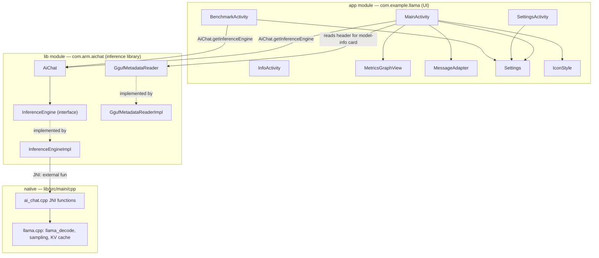

# ARCHITECTURE

How ENTITY is put together, end to end: Kotlin UI → `com.arm.aichat` inference library → JNI →
llama.cpp. File paths below are relative to `app/entity.android/`.

## Component map



`AiChat` is the only entry point the UI needs: `AiChat.getInferenceEngine(context)` returns a
process-wide singleton `InferenceEngine`. `MainActivity` and `BenchmarkActivity` both grab the same
instance, so chat and benchmark share one loaded model and one native context.

## Kotlin UI layer (`app/src/main/java/com/example/llama`)

### `MainActivity`
The main screen and the largest file in the app. Owns:
- **Model lifecycle**: `scanModels()` looks in `getExternalFilesDir("models")` and
  `filesDir/models` for `.gguf` files; `showModelPicker()` lists them or offers **Import from
  device…** (SAF `OpenDocument`, wired through `getContent`/`importAndLoad`) when none exist.
  `importAndLoad` streams the picked file into private storage with progress callbacks
  (`copyWithProgress`), then calls `prepareModel`.
- **`prepareModel(model)`**: the model-load pipeline — reads `Settings`, computes the context size
  (`adaptiveContext()` in Auto mode, or the manual value), calls
  `engine.applyConfig(...)` then `engine.loadModel(path)` then `engine.setSystemPrompt(...)`, and
  reads the GGUF header via `GgufMetadataReader` for the model-info card (`buildModelInfo`).
- **Chat loop**: `handleUserInput()` launches a coroutine that collects
  `engine.sendUserPrompt(text, maxTokens)` (a `Flow<String>`), appending tokens to the RecyclerView
  through `MessageAdapter`, updating TTFT/tokens/sec, and applying the **thermal-aware guard**
  (`isHot()` + `delay(THERMAL_DELAY_MS)` every 8 tokens once `PowerManager.currentThermalStatus`
  reaches `THERMAL_STATUS_SEVERE`, Auto mode only).
- **Live metrics**: `snapMetrics()` reads `BatteryManager` (temperature, voltage, current →
  watts) and `ActivityManager.MemoryInfo` (free RAM) once per render tick, feeding both the stats
  bar and `MetricsGraphView`.
- **Menu-driven navigation** to `SettingsActivity`, `InfoActivity`, `BenchmarkActivity`, plus
  per-series stat toggles and theme switching (persisted in `SharedPreferences`, see `Settings`).

### `SettingsActivity`
A thin binder between `SeekBar`s and `SharedPreferences` keys defined in `Settings` (temperature,
top-k, top-p, max tokens, context size steps `1024/2048/4096/8192`, thread count), plus the
**Auto (optimized)** master switch that greys out the manual controls, and the app-icon chooser
(delegates to `IconStyle`). Nothing here touches the engine directly — values are read fresh by
`MainActivity`/`BenchmarkActivity` on next use.

### `BenchmarkActivity`
Runs `InferenceEngine.bench()` twice against the already-loaded model — once at `NAIVE_THREADS = 8`,
once at `OPT_THREADS = 4` — via `engine.applyConfig(ctx, threads, ...)` before each pass (thread
count is the only thing that changes; the native side re-derives and re-pins the affinity set from
it, see below). A coroutine samples `BatteryManager.BATTERY_PROPERTY_CURRENT_NOW` every 150 ms
during each pass to compute average watts and tokens/watt. Results render into a small table and a
copyable text summary. If the phone is charging, power/efficiency are hidden (invalid while on
charger) but speed numbers still show.

### `InfoActivity`
Static text (`InfoActivity.CONTENT`) describing every optimization the app actually ships — kept
intentionally free of native/CLI-only claims (e.g. it never mentions realtime priority; see
[`OPTIMIZATIONS.md`](OPTIMIZATIONS.md)).

### `MetricsGraphView`
A hand-rolled multi-series line chart (`View.onDraw`, no chart library). Each of the six series
(`stat_tokens`, `stat_speed`, `stat_ttft`, `stat_temp`, `stat_power`, `stat_memory`) keeps its own
120-sample ring buffer (`ArrayDeque`) and is normalized to its own min/max so tokens, watts, °C and
GB can share one canvas. `addSample()` is called once per render tick from `MainActivity`.

### `MessageAdapter` / `Message`
Plain `RecyclerView.Adapter` with two view types (user/assistant bubbles) and a `PAYLOAD_TEXT`
partial-bind path so appending streamed tokens doesn't re-inflate the row.

### `Settings`
Single source of truth for preference keys and defaults, shared by `MainActivity`,
`SettingsActivity`, and `BenchmarkActivity` so the three screens can't drift out of sync on key
names. `KEY_ACTIVE_CTX` records the context size actually used by the currently loaded model, so
the benchmark can restore it after temporarily reconfiguring threads.

### `IconStyle`
Toggles which of two `activity-alias` launcher entries (`.MainBlack` / `.MainWhite`) is enabled,
so the home-screen icon can follow the system theme or a manual choice. Guarded so exactly one
alias is ever enabled — the app can never disappear from the launcher.

## Inference library (`lib/src/main/java/com/arm/aichat`)

### `AiChat`
One-liner facade: `AiChat.getInferenceEngine(context)` → `InferenceEngineImpl.getInstance(context)`.

### `InferenceEngine` (interface) / `InferenceEngineImpl`
The public contract (`loadModel`, `setSystemPrompt`, `sendUserPrompt`, `bench`, `applyConfig`,
`applySampler`, `newConversation`, `cleanUp`, `destroy`) and its JNI-backed implementation.
`InferenceEngineImpl`:
- Is a **singleton** (`getInstance`), constructed with the app's native library directory.
- Runs **every** native call on a **single-threaded dispatcher**
  (`Dispatchers.IO.limitedParallelism(1)`) — llama.cpp's context/session state is not thread-safe
  across calls, so serializing here is what makes the rest of the app free to use normal
  coroutines without touching a mutex.
- Exposes a `StateFlow<InferenceEngine.State>` (`Uninitialized → Initializing → Initialized →
  LoadingModel → ModelReady → ProcessingSystemPrompt/ProcessingUserPrompt/Generating → ModelReady`,
  or `Error`) that the UI uses to gate actions (e.g. can't benchmark while generating).
- `sendUserPrompt()` returns a cold `Flow<String>` that calls `processUserPrompt` once, then loops
  `generateNextToken()` until it returns `null` (EOG, context exhaustion, or cancellation).
- Declares the `external fun` JNI surface 1:1 with the exported functions in `ai_chat.cpp`
  (`init`, `load`, `prepare`, `systemInfo`, `benchModel`, `configure`, `setSampler`,
  `processSystemPrompt`, `processUserPrompt`, `generateNextToken`, `unload`, `shutdown`).
  `@FastNative` is applied only to the short, frequently-called setters and `generateNextToken` —
  the long-running calls (load, decode-heavy paths) deliberately omit it so the thread can hit a
  GC safepoint instead of stalling the collector for seconds.

### GGUF reader (`gguf/GgufMetadataReader`, `internal/gguf/GgufMetadataReaderImpl`, `gguf/GgufMetadata`, `gguf/FileType`)
A pure-Kotlin GGUF header parser — **it reads only the metadata/key-value section, never the
tensor weights**, so it's cheap to run on every model load. `GgufMetadata` mirrors the GGUF spec's
grouped keys (`BasicInfo`, `ArchitectureInfo`, `DimensionsInfo`, `AttentionInfo`, `RopeInfo`,
`ExpertsInfo`, tokenizer/author/base-model info). `FileType` maps the numeric `general.file_type`
code to the same human labels `llama-cli` prints (e.g. `2` → `"Q4_0"`). `MainActivity.buildModelInfo`
consumes this to render the model-info card (⋮ → Model info).

## Native / JNI layer (`lib/src/main/cpp/ai_chat.cpp`)

All native state is process-global (`g_model`, `g_context`, `g_batch`, `g_sampler`,
`g_chat_templates`, `g_fast_cpus`/`g_fast_count`) — there is exactly one model loaded at a time,
matching the single-threaded dispatcher above.

- **`init(nativeLibDir)`** — loads every CPU backend variant present in the APK's native lib dir
  (`ggml_backend_load_all_from_path`) and calls `llama_backend_init()`. Because the build only ships
  one CPU backend (`armv8.2-a+dotprod`, see [`OPTIMIZATIONS.md`](OPTIMIZATIONS.md)), "every variant"
  is just that one.
- **`load(path)`** → `llama_model_load_from_file`.
- **`prepare()`** → `init_context(g_model)`, allocates `g_batch`, builds chat templates, creates the
  sampler.
- **`init_context(model, n_ctx_override)`** — the core setup function:
  1. Picks thread count: the app's `configure()`-supplied value if `> 0`, else
     `clamp(n_online_cpus - N_THREADS_HEADROOM, N_THREADS_MIN, N_THREADS_MAX)` (2–4 threads,
     headroom 2).
  2. Picks context size: an explicit override (used by the benchmark) wins, else the configured
     value, else `DEFAULT_CONTEXT_SIZE` (4096).
  3. Calls `llama_init_from_model` with `n_batch = n_ubatch = 512`.
  4. Records the context size actually allocated back into `g_n_ctx` (bounds the completion loop).
  5. Calls **`build_fast_cpu_set(n_threads)`** then **`pin_to_fast_cores()`** — see
     [`OPTIMIZATIONS.md`](OPTIMIZATIONS.md#1-big-core-affinity) for exactly what these do.
- **`configure(nCtx, nThreads, temp, topK, topP)` / `setSampler(temp, topK, topP)`** — JNI setters
  for the globals above; `configure` takes effect on the *next* `loadModel`/`prepare`, `setSampler`
  rebuilds the live sampler immediately (used by Settings' live temperature/top-k/top-p sliders).
- **Completion loop**: `processSystemPrompt` → tokenizes and decodes the system prompt via
  `decode_tokens_in_batches` (which re-pins affinity on every call and triggers `shift_context()`
  if a batch would overflow the KV window); `processUserPrompt` tokenizes/decodes the user turn and
  records `stop_generation_position = current_position + n_predict`; `generateNextToken` samples one
  token (`common_sampler_sample`), decodes it, advances `current_position`, and returns the token's
  UTF-8 text (buffering partial multi-byte sequences via `cached_token_chars`/`is_valid_utf8`) or
  `nullptr` on EOG / stop-position / context-shift failure.
- **`shift_context()`** — infinite-generation strategy: on overflow, discards the oldest half of the
  tokens after the system prompt (`llama_memory_seq_rm` + `llama_memory_seq_add` to slide the rest
  down), so long conversations keep going instead of hard-stopping at the context limit.
- **`benchModel(pp, tg, pl, nr)`** — the shared implementation behind both the in-app Benchmark
  screen and CLI-style `llama-bench` numbers: builds its own context sized to `pp`, times a raw
  prompt-processing decode and a raw token-generation loop (`nr` repeats, mean ± stddev), then
  **restores** `g_n_ctx`/`g_fast_cpus`/`g_fast_count` so the chat session isn't left on the
  benchmark's context or affinity set (this restore was a bugfix — see `CHANGELOG.md` v1.3.0/v1.4.0).
- **`unload()` / `shutdown()`** — free sampler/templates/batch/context/model, then
  `llama_backend_free()`.

## Token flow: UI → JNI → llama.cpp → UI

```
User types → MainActivity.handleUserInput()
  → engine.sendUserPrompt(text, maxTokens)          [Kotlin, InferenceEngineImpl, llamaDispatcher]
    → processUserPrompt(text, maxTokens)             [JNI]
      → common_tokenize + decode_tokens_in_batches    [C++]
        → pin_to_fast_cores()                         [sched_setaffinity]
        → llama_decode(...)                           [llama.cpp, big-core threads]
    → loop: generateNextToken()                       [JNI, called repeatedly]
      → common_sampler_sample / common_sampler_accept [C++ sampling]
      → llama_decode(...) for the new token           [llama.cpp]
      → returns UTF-8 token text (or null → stop)
    → Flow emits each token back on llamaDispatcher
  → MainActivity collects on Dispatchers.Default, renders on Main:
      lastAssistantMsg.append(token) → MessageAdapter.notifyItemChanged
      snapMetrics() → stats bar / MetricsGraphView
```

Every step from `processUserPrompt` onward runs on the single-threaded `llamaDispatcher`, so the
Kotlin side never needs its own lock around the native context — serialization is structural, not
defensive.

## File map

| Path | Role |
|---|---|
| `app/src/main/java/com/example/llama/MainActivity.kt` | Chat screen, model lifecycle, metrics |
| `app/src/main/java/com/example/llama/SettingsActivity.kt` | Manual tuning + Auto toggle + icon chooser |
| `app/src/main/java/com/example/llama/BenchmarkActivity.kt` | Naive-vs-optimized in-app benchmark |
| `app/src/main/java/com/example/llama/InfoActivity.kt` | Static "how it's optimized" page |
| `app/src/main/java/com/example/llama/MetricsGraphView.kt` | Custom multi-series graph |
| `app/src/main/java/com/example/llama/MessageAdapter.kt` | Chat RecyclerView adapter |
| `app/src/main/java/com/example/llama/Settings.kt` | Shared SharedPreferences keys/defaults |
| `app/src/main/java/com/example/llama/IconStyle.kt` | Launcher-icon alias switcher |
| `lib/src/main/java/com/arm/aichat/AiChat.kt` | Public facade |
| `lib/src/main/java/com/arm/aichat/InferenceEngine.kt` | Engine contract + state machine |
| `lib/src/main/java/com/arm/aichat/internal/InferenceEngineImpl.kt` | JNI wrapper, single-threaded dispatcher |
| `lib/src/main/java/com/arm/aichat/gguf/*.kt` | GGUF header reader (metadata only) |
| `lib/src/main/cpp/ai_chat.cpp` | Native inference: context, completion loop, affinity, benchmark |
| `lib/src/main/cpp/CMakeLists.txt` | Native build: pulls in llama.cpp via `add_subdirectory` |
| `lib/build.gradle.kts` | ABI/backend selection (`GGML_CPU_ARM_ARCH`, `GGML_CPU_ALL_VARIANTS`) |

See [`BUILD.md`](BUILD.md) for how to build and run this, and [`OPTIMIZATIONS.md`](OPTIMIZATIONS.md)
for a deep dive on each Arm-specific technique referenced above.
