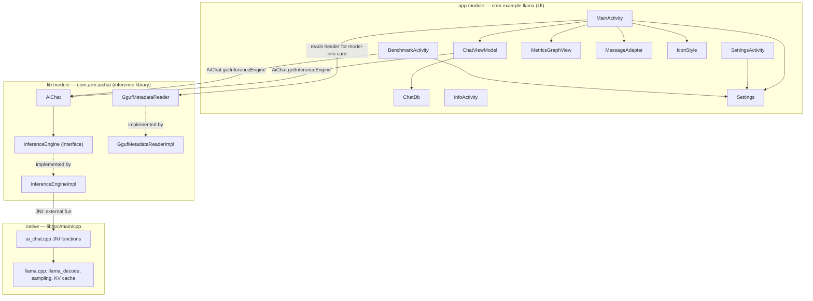

# ARCHITECTURE

How ENTITY is put together, end to end: Kotlin UI → `com.arm.aichat` inference library → JNI →
llama.cpp. File paths below are relative to `app/entity.android/`.

## Component map



`AiChat` is the only entry point the UI needs: `AiChat.getInferenceEngine(context)` returns a
process-wide singleton `InferenceEngine`. `ChatViewModel` (owned by `MainActivity`) and
`BenchmarkActivity` both grab the same instance, so chat and benchmark share one loaded model and
one native context.

## Kotlin UI layer (`app/src/main/java/com/example/llama`)

### `MainActivity`
The main screen and the largest file in the app. Owns:
- **Model lifecycle**: `scanModels()` looks in `getExternalFilesDir("models")` and
  `filesDir/models` for `.gguf` files; `showModelPicker()` lists them or offers **Import from
  device…** (SAF `OpenDocument`, wired through `getContent`/`importAndLoad`) when none exist.
  `importAndLoad` streams the picked file into private storage with progress callbacks
  (`copyWithProgress`), then calls `prepareModel`.
- **`prepareModel(model)`**: the model-load pipeline — reads `Settings`, computes the context size
  (`adaptiveContext()` in Auto mode, or the manual value), calls
  `engine.applyConfig(...)` then `engine.loadModel(path)` then `engine.setSystemPrompt(...)`, and
  reads the GGUF header via `GgufMetadataReader` for the model-info card (`buildModelInfo`).
- **Chat loop delegated to `ChatViewModel`**: `handleUserInput()` just calls `vm.send(userMsg)`;
  `MainActivity` observes `vm.messages`/`vm.genState`/`vm.stats` (via `onGenPhase`/`onStats`) and
  renders into the RecyclerView through `MessageAdapter`, appending streamed tokens and updating
  TTFT/tokens/sec as the view model's state changes.
- **Live metrics**: `snapMetrics()` reads `BatteryManager` (temperature, voltage, current →
  watts) and `ActivityManager.MemoryInfo` (free RAM) once per render tick, feeding both the stats
  bar and `MetricsGraphView`.
- **Menu-driven navigation** to `SettingsActivity`, `InfoActivity`, `BenchmarkActivity`, plus
  per-series stat toggles, theme switching, and the **conversation switcher** dialog (title +
  relative time, tap to switch, long-press rename/delete — backed by `vm.listConversations()` /
  `vm.switchTo()` / `vm.renameConversation()` / `vm.deleteConversation()`), all persisted in
  `SharedPreferences` (see `Settings`) or `ChatDb`.

### `ChatViewModel`
An `AndroidViewModel` that owns chat and generation state so it survives rotation and theme
changes and keeps generating while the app is backgrounded — `MainActivity` (`by viewModels()`)
just observes it. Holds the `InferenceEngine` handle (`AiChat.getInferenceEngine`), the in-memory
`messages` list, a `GenPhase` state (`IDLE`/`PRIMING`/`GENERATING`) and `GenStats` (tokens, TTFT,
tok/s timestamps) as `StateFlow`s, and a `ChatDb` instance for persistence. `send()`,
`regenerateLastAnswer()`, `newConversation()`, `switchTo()`, `renameConversation()`, and
`deleteConversation()` are the operations `MainActivity` calls; the engine is only destroyed when
the activity is finishing, not on rotation. The **thermal-aware guard** lives here alongside the
streaming-token collection loop. In Auto mode, every eighth generated token asks
`ThermalGuard.delayMs` for a cooperative delay: 0 ms at NONE or LIGHT, 6 ms at MODERATE,
and 12 ms at SEVERE or above. The thermal status is cached for one second; Efficiency mode doubles
the selected delay.

`primedConversationId` tracks which conversation's turns the live engine KV currently reflects;
it's cleared on load/switch/restore/interrupted generation. Before sending if it doesn't match the
on-screen conversation, `startGeneration()` calls `engine.newConversation(systemPrompt)` then, for
a restored/switched conversation with prior turns, `engine.primeHistory(priorTurns)` — surfaced to
the user as a "Preparing conversation…" status (`GenPhase.PRIMING`) — before the next
`sendUserPrompt`. Partial assistant answers are persisted to `ChatDb` on `Stop` (`onCompletion`
always writes whatever was streamed so far).

### `ChatDb`
`SQLiteOpenHelper`-based chat persistence (`chats.db`, zero new dependencies) with two tables:
`conversations(id, title, created_at, updated_at)` and
`messages(id, conversation_id, role, content, created_at)` with a cascading foreign key on
`conversation_id`. Auto-titles a conversation from the first user message
(`setTitleIfEmpty`); `latestConversationId()` restores the last conversation on launch
(`ChatViewModel.restoreLatest()`); `listConversations()` backs the conversation-switcher dialog.

### `SettingsActivity`
A thin binder between `SeekBar`s and `SharedPreferences` keys defined in `Settings` (temperature,
top-k, top-p, max tokens, context size steps `1024/2048/4096/8192`, thread count), plus the
**Auto (optimized)** master switch that greys out the manual controls, and the app-icon chooser
(delegates to `IconStyle`). Nothing here touches the engine directly — values are read fresh by
`MainActivity`/`BenchmarkActivity` on next use.

### `BenchmarkActivity`
Runs `InferenceEngine.bench()` for the selected count of 1, 3, or 5 passes per configuration,
across three arms:

| Arm | `applyConfig` | Behaviour |
|---|---|---|
| Naïve | `NAIVE_THREADS = 8`, `pinCores = true` | Eight threads; the fast-core set spans every core, so this is the all-core default. |
| Threads only | `autoGenThreads()`, `pinCores = false` | Auto's thread count with affinity off: no `sched_setaffinity`, no pinned pool, scheduler-placed. The ablation control. |
| Optimized | `OPT_THREADS_AUTO = 0`, `pinCores = true` | The same Auto configuration used for chat: native code pins generation to the capacity-ranked fast cores, and prompt processing runs on the performance cluster (see below). |

`autoGenThreads()` mirrors `top_cluster_core_count()` in `ai_chat.cpp` - the cores whose
`cpuinfo_max_freq` is within 10% of the fastest, clamped to
`DeviceOptimizer.MIN_THREADS`/`MAX_THREADS` = **2..6** - so the threads-only arm runs the same
thread count as Auto and differs from it *only* in placement. That is what makes the decode gap
between them an attribution rather than a coincidence.

Since v3.5.0 the two inference phases run **different widths**. Decode uses the rule above.
Prompt processing uses `prompt_thread_count()`: every core strictly above the slowest
`cpu_capacity` tier, never narrower than decode, capped at `N_THREADS_MAX`. On a 4+4 device the
two are identical; on a prime-core flagship decode stays at 2 while prefill widens to the big
cluster. See [OPTIMIZATIONS.md](OPTIMIZATIONS.md) §1 for the derivation and
[../benchmarks/CONTRIBUTED-DATA.md](../benchmarks/CONTRIBUTED-DATA.md) for the measurements that
forced the split.

The `finally` block restores the user's **Core placement** setting (`Settings.pinCores`), not a
hardcoded `true` - otherwise finishing a benchmark would silently re-pin someone who chose the
system scheduler.

A coroutine samples `BatteryManager.BATTERY_PROPERTY_CURRENT_NOW` every 150 ms during each pass.
`PowerMath` resolves the OEM microamp or milliamp ambiguity before the app calculates average
watts and tokens per watt. Results render as median plus population standard deviation with derived
TTFT, a copyable summary, and CSV export. If the phone is charging, power and efficiency are hidden
while speed results remain visible. The current screenshot-backed reference result is
[`../benchmarks/BENCHMARKS.md`](../benchmarks/BENCHMARKS.md).

### `InfoActivity`
Static text (`InfoActivity.CONTENT`) describing every optimization the app actually ships — kept
intentionally free of native/CLI-only claims (e.g. it never mentions realtime priority; see
[`OPTIMIZATIONS.md`](OPTIMIZATIONS.md)).

### `MetricsGraphView`
A hand-rolled multi-series line chart (`View.onDraw`, no chart library). Each of the seven series
(`stat_tokens`, `stat_speed`, `stat_ttft`, `stat_temp`, `stat_power`, `stat_cpu`, `stat_memory`) keeps its own
120-sample ring buffer (`ArrayDeque`) and is normalized to its own min/max so tokens, watts, °C and
GB can share one canvas. `stat_cpu` is app-process CPU percentage and may exceed 100% while native
workers use multiple cores. `addSample()` is called once per render tick from `MainActivity`.

### `MessageAdapter` / `Message`
Plain `RecyclerView.Adapter` with two view types (user/assistant bubbles) and a `PAYLOAD_TEXT`
partial-bind path so appending streamed tokens doesn't re-inflate the row.

### `Settings`
Single source of truth for preference keys and defaults, shared by `MainActivity`,
`SettingsActivity`, and `BenchmarkActivity` so the three screens can't drift out of sync on key
names. `KEY_ACTIVE_CTX` records the context size actually used by the currently loaded model, so
the benchmark can restore it after temporarily reconfiguring threads.

### `IconStyle`
Toggles which of two `activity-alias` launcher entries (`.MainBlack` / `.MainWhite`) is enabled,
so the home-screen icon can follow the system theme or a manual choice. Guarded so exactly one
alias is ever enabled — the app can never disappear from the launcher.

## Inference library (`lib/src/main/java/com/arm/aichat`)

### `AiChat`
One-liner facade: `AiChat.getInferenceEngine(context)` → `InferenceEngineImpl.getInstance(context)`.

### `InferenceEngine` (interface) / `InferenceEngineImpl`
The public contract (`loadModel`, `setSystemPrompt`, `sendUserPrompt`, `bench`, `applyConfig`,
`applySampler`, `newConversation`, `primeHistory`, `cleanUp`, `destroy`) plus the `ChatTurn(role,
text)` data class, and its JNI-backed implementation. `InferenceEngineImpl`:
- Is a **singleton** (`getInstance`), constructed with the app's native library directory.
- Runs **every** native call on a **single-threaded dispatcher**
  (`Dispatchers.IO.limitedParallelism(1)`) — llama.cpp's context/session state is not thread-safe
  across calls, so serializing here is what makes the rest of the app free to use normal
  coroutines without touching a mutex.
- Exposes a `StateFlow<InferenceEngine.State>` (`Uninitialized → Initializing → Initialized →
  LoadingModel → ModelReady → ProcessingSystemPrompt/ProcessingUserPrompt/Generating → ModelReady`,
  or `Error`) that the UI uses to gate actions (e.g. can't benchmark while generating).
- `sendUserPrompt()` returns a cold `Flow<String>` that calls `processUserPrompt` once, then loops
  `generateNextToken()` until it returns `null` (EOG, context exhaustion, or cancellation).
- Declares the `external fun` JNI surface 1:1 with the exported functions in `ai_chat.cpp`
  (`init`, `load`, `prepare`, `systemInfo`, `benchModel`, `configure`, `setSampler`,
  `processSystemPrompt`, `processUserPrompt`, `primeHistoryNative`, `generateNextToken`, `unload`,
  `shutdown`). `@FastNative` is applied only to the short, frequently-called setters and
  `generateNextToken` — the long-running calls (load, decode-heavy paths, `primeHistoryNative`)
  deliberately omit it so the thread can hit a GC safepoint instead of stalling the collector for
  seconds.

### GGUF reader (`gguf/GgufMetadataReader`, `internal/gguf/GgufMetadataReaderImpl`, `gguf/GgufMetadata`, `gguf/FileType`)
A pure-Kotlin GGUF header parser — **it reads only the metadata/key-value section, never the
tensor weights**, so it's cheap to run on every model load. `GgufMetadata` mirrors the GGUF spec's
grouped keys (`BasicInfo`, `ArchitectureInfo`, `DimensionsInfo`, `AttentionInfo`, `RopeInfo`,
`ExpertsInfo`, tokenizer/author/base-model info). `FileType` maps the numeric `general.file_type`
code to the same human labels `llama-cli` prints (e.g. `2` → `"Q4_0"`). `MainActivity.buildModelInfo`
consumes this to render the model-info card (menu drawer → MODEL INFO).

## Native / JNI layer (`lib/src/main/cpp/ai_chat.cpp`)

All native state is process-global (`g_model`, `g_context`, `g_batch`, `g_sampler`,
`g_chat_templates`, `g_fast_cpus`/`g_fast_count`, `g_tp_gen`/`g_tp_batch`) — there is exactly one
model loaded at a time, matching the single-threaded dispatcher above.

- **`init(nativeLibDir)`** — loads every CPU backend variant present in the APK's native lib dir
  (`ggml_backend_load_all_from_path`) and calls `llama_backend_init()`. The build ships 7 Arm variants
  (armv8.0, armv8.2×2, armv8.6, armv9.0, armv9.2×2, each with KleidiAI); ggml scores them at startup
  and `prepare()` selects the best one. Also resolves the ggml threadpool functions
  (`ggml_threadpool_new`/`_free`) via
  `ggml_backend_reg_get_proc_address` on the CPU backend's registry — they're needed at runtime
  (see `prepare()` below) but aren't linkable symbols in a `GGML_BACKEND_DL` build, since the CPU
  backend is a dynamically loaded module.
- **`load(path)`** → `llama_model_load_from_file`.
- **`prepare()`** → `init_context(g_model)`, allocates `g_batch`, builds chat templates, creates the
  sampler, then builds the **two persistent threadpools** — see
  [`OPTIMIZATIONS.md`](OPTIMIZATIONS.md) for the split rationale and fallback behavior.
- **`init_context(model, n_ctx_override)`** — the core setup function:
  1. Picks thread count: the app's `configure()`-supplied value if `> 0`, else
     `clamp(n_online_cpus - N_THREADS_HEADROOM, N_THREADS_MIN, N_THREADS_MAX)` (2-6 threads,
     headroom 2). This is the generation thread count; prompt-processing width is derived
     separately in `prepare()`.
  2. Picks context size: an explicit override (used by the benchmark) wins, else the configured
     value, else `DEFAULT_CONTEXT_SIZE` (4096).
  3. Calls `llama_init_from_model` with `n_batch = n_ubatch = 512`.
  4. Records the context size actually allocated back into `g_n_ctx` (bounds the completion loop).
  5. Calls **`build_fast_cpu_set(n_threads)`** then **`pin_to_fast_cores()`** — see
     [`OPTIMIZATIONS.md`](OPTIMIZATIONS.md#1-big-core-affinity) for exactly what these do.
- **`configure(nCtx, nThreads, temp, topK, topP, pinCores, adpf)`** / **`setSampler(temp, topK,
  topP)`** — JNI setters for the globals above; `configure` takes effect on the *next*
  `loadModel`/`prepare`, `setSampler` rebuilds the live sampler immediately (used by Settings'
  live temperature/top-k/top-p sliders). `pinCores` (v3.5.0) backs the Core placement setting;
  `adpf` (v3.6.0) toggles the performance-hint session, closed and reopened on change since a
  session can only be configured at open time - see [`OPTIMIZATIONS.md`](OPTIMIZATIONS.md) for
  both.
- **Completion loop**: `processSystemPrompt` → tokenizes and decodes the system prompt via
  `decode_tokens_in_batches` (which re-pins affinity on every call and triggers `shift_context()`
  if a batch would overflow the KV window); `processUserPrompt` tokenizes/decodes the user turn and
  records `stop_generation_position = current_position + n_predict`; `primeHistoryNative` rebuilds
  the KV state from a persisted conversation's turns on top of the already-decoded system prompt,
  without generating (backs `InferenceEngine.primeHistory` — see below); `generateNextToken` samples
  one token (`common_sampler_sample`), decodes it, advances `current_position`, and returns the
  token's UTF-8 text (buffering partial multi-byte sequences via `cached_token_chars`/
  `is_valid_utf8`) or `nullptr` on EOG / stop-position / context-shift failure.
- **`shift_context()`** — infinite-generation / graceful context-full strategy: on overflow,
  discards the oldest half of the tokens after the system prompt (`llama_memory_seq_rm` +
  `llama_memory_seq_add` to slide the rest down), so long conversations keep going instead of
  hard-stopping at the context limit. The system prompt (`system_prompt_position`) is always
  preserved. Called from both `decode_tokens_in_batches` (mid-prompt) and `generateNextToken`
  (mid-generation), with `stop_generation_position` adjusted by the discard count on the
  generation path so the token budget stays correct after a trim — see
  [`OPTIMIZATIONS.md`](OPTIMIZATIONS.md) for the two position-desync bugs this fixed.
- **`benchModel(pp, tg, pl, nr)`** — the shared implementation behind both the in-app Benchmark
  screen and CLI-style `llama-bench` numbers: builds its own context sized to `pp`, times a raw
  prompt-processing decode and a raw token-generation loop (`nr` repeats, mean ± stddev), then
  **restores** `g_n_ctx`/`g_fast_cpus`/`g_fast_count` so the chat session isn't left on the
  benchmark's context or affinity set (this restore was a bugfix — see `CHANGELOG.md` v1.3.0/v1.4.0).
- **`unload()` / `shutdown()`** — free sampler/templates/batch/context/model and both threadpools
  (`g_tp_gen`/`g_tp_batch`, each freed only if non-null then reset to `nullptr`, making repeated
  `unload()` calls safe), then `llama_backend_free()`.

### `InferenceEngine.primeHistory` / `ChatTurn`

`data class ChatTurn(role, text)` plus `suspend fun primeHistory(history: List<ChatTurn>)` on
`InferenceEngine` let the Kotlin side rebuild the native KV state from a persisted conversation
without generating — used when `ChatViewModel` restores or switches to a conversation whose turns
already exist in `ChatDb` but haven't been decoded into the live context yet.
`InferenceEngineImpl.primeHistory` marshals the turns to `primeHistoryNative`, which formats/
tokenizes each turn through the same chat-template path as a live turn, then decodes the
suffix (system prompt + as many of the most recent turns as fit the context) so the next
`sendUserPrompt` continues seamlessly instead of starting from a cold KV cache.

## Token flow: UI → JNI → llama.cpp → UI

```
User types → MainActivity.handleUserInput() → ChatViewModel.send(text)
  → [if the engine KV doesn't match this conversation: "Preparing conversation…"]
    → engine.newConversation(systemPrompt) + engine.primeHistory(priorTurns)  [Kotlin → JNI]
      → primeHistoryNative(roles, texts)               [JNI]
        → common_tokenize + decode_tokens_in_batches per turn (no generation) [C++]
  → engine.sendUserPrompt(text, maxTokens)          [Kotlin, InferenceEngineImpl, llamaDispatcher]
    → processUserPrompt(text, maxTokens)             [JNI]
      → common_tokenize + decode_tokens_in_batches    [C++]
        → pin_to_fast_cores()                         [sched_setaffinity]
        → llama_decode(...)                           [llama.cpp, prompt-processing threadpool]
    → loop: generateNextToken()                       [JNI, called repeatedly]
      → common_sampler_sample / common_sampler_accept [C++ sampling]
      → llama_decode(...) for the new token           [llama.cpp, generation threadpool]
      → returns UTF-8 token text (or null → stop)
    → Flow emits each token back on llamaDispatcher
  → ChatViewModel collects, updates messages/genState/stats StateFlows;
    MainActivity observes them and renders on Main:
      MessageAdapter.notifyItemChanged (payload text) → RecyclerView
      snapMetrics() → stats bar / MetricsGraphView
  → ChatViewModel persists the assistant reply to ChatDb in onCompletion (Stop included)
```

Every step from `processUserPrompt` onward runs on the single-threaded `llamaDispatcher`, so the
Kotlin side never needs its own lock around the native context — serialization is structural, not
defensive.

## File map

| Path | Role |
|---|---|
| `app/src/main/java/com/example/llama/MainActivity.kt` | Chat screen, model lifecycle, metrics |
| `app/src/main/java/com/example/llama/ChatViewModel.kt` | Chat + generation state, survives rotation, drives persistence |
| `app/src/main/java/com/example/llama/ChatDb.kt` | `SQLiteOpenHelper` chat persistence (`chats.db`) |
| `app/src/main/java/com/example/llama/SettingsActivity.kt` | Manual tuning + Auto toggle + icon chooser |
| `app/src/main/java/com/example/llama/BenchmarkActivity.kt` | Naive-vs-optimized in-app benchmark |
| `app/src/main/java/com/example/llama/InfoActivity.kt` | Static "how it's optimized" page |
| `app/src/main/java/com/example/llama/MetricsGraphView.kt` | Custom multi-series graph |
| `app/src/main/java/com/example/llama/MessageAdapter.kt` | Chat RecyclerView adapter |
| `app/src/main/java/com/example/llama/Settings.kt` | Shared SharedPreferences keys/defaults, incl. `KEY_PLACEMENT` and `pinCores()` |
| `app/src/main/java/com/example/llama/Markdown.kt` | Hand-rolled Markdown -> `Spanned`; lifts math out before the emphasis pass |
| `app/src/main/java/com/example/llama/Latex.kt` | LaTeX -> `Spanned`: delimiter scanner, Unicode tables, `FractionSpan`, `RadicalSpan` |
| `app/src/main/java/com/example/llama/PowerMath.kt` | Battery power; resolves the voltage unit before the microamp/milliamp current unit |
| `app/src/main/java/com/example/llama/IconStyle.kt` | Launcher-icon alias switcher |
| `lib/src/main/java/com/arm/aichat/AiChat.kt` | Public facade |
| `lib/src/main/java/com/arm/aichat/InferenceEngine.kt` | Engine contract + state machine |
| `lib/src/main/java/com/arm/aichat/internal/InferenceEngineImpl.kt` | JNI wrapper, single-threaded dispatcher |
| `lib/src/main/java/com/arm/aichat/gguf/*.kt` | GGUF header reader (metadata only) |
| `lib/src/main/cpp/ai_chat.cpp` | Native inference: context, completion loop, affinity, benchmark |
| `lib/src/main/cpp/CMakeLists.txt` | Native build: pulls in llama.cpp via `add_subdirectory` |
| `lib/build.gradle.kts` | ABI/backend selection (`GGML_CPU_ARM_ARCH`, `GGML_CPU_ALL_VARIANTS`) |

See [`BUILD.md`](BUILD.md) for how to build and run this, and [`OPTIMIZATIONS.md`](OPTIMIZATIONS.md)
for a deep dive on each Arm-specific technique referenced above.
